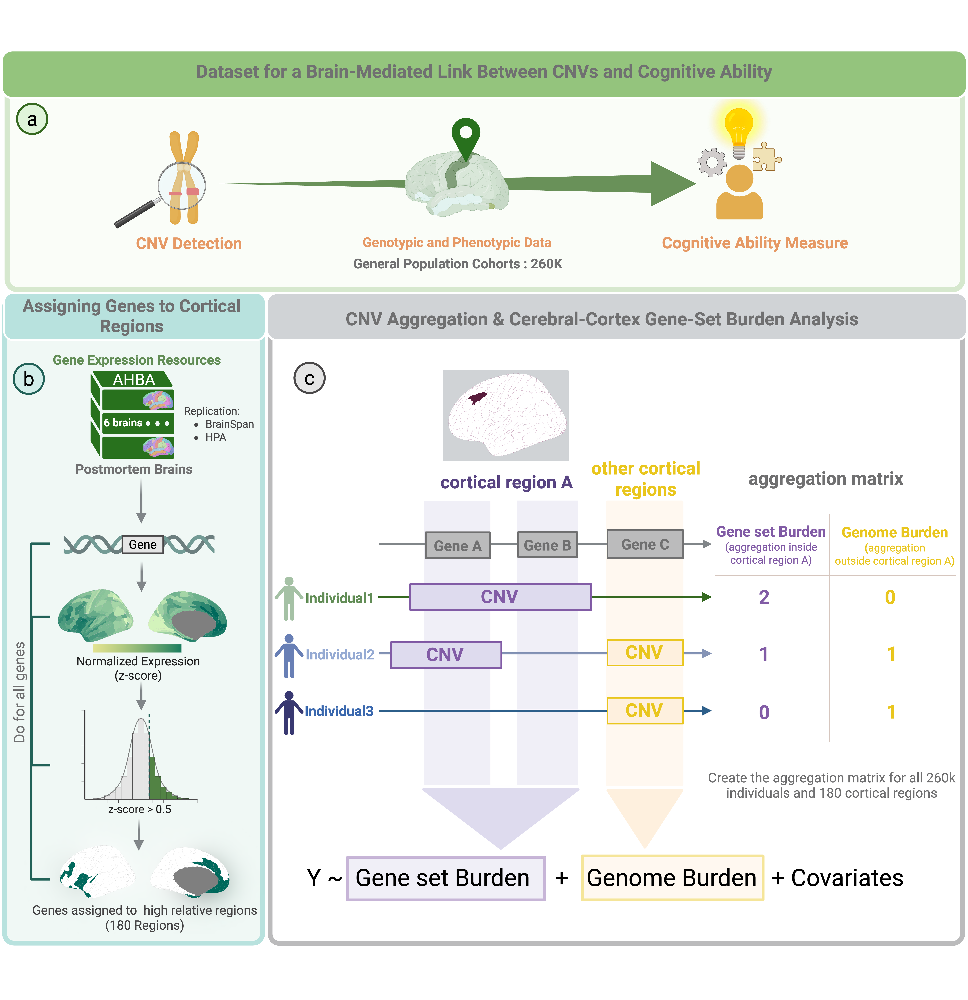

# CC_GSABA
The Cerebral Cortical Gene-Set Burden Analysis (CC-GSBA) pipeline, part of the PGC-CNV working group, is designed to investigate the impact of Copy Number Variants (CNVs) on Cognitive Ability using Cerebral Cortical Gene-Set Burden Analysis. This repository contains all the code and data required to reproduce the figures and statistical analyses for the project. 
<p align="center">
 
</p>

## Project Title
Mirror effect of genomic deletions and duplications on cognitive ability across the human ecerebral cortex

## Project Workflow
This figure outlines our methodology for associating CNVs with cognitive ability by leveraging gene expression data across cortical regions. The analysis integrates genotypic and phenotypic data from large population cohorts with gene expression data from the Allen Human Brain Atlas (AHBA).

- Gene Assignment: Each gene is mapped to cortical regions where it shows preferential expression (z-score > 0.5). This process is repeated for all genes, resulting in 180 distinct regional gene sets.
- CNV Aggregation: For each individual, we calculate two burden metrics for each cortical region:
- Gene-Set Burden: The count of CNVs overlapping genes within a specific regional gene set.
- Genome Burden: The count of CNVs outside that specific regional gene set, serving as a genome-wide control.
Regression Analysis: A regression model is applied to test for a region-specific association between CNV burden and cognitive ability, while controlling for the genome-wide burden and other covariates.  Cognitive ability (Y) is modeled as a function of the Gene-Set Burden and the Genome Burden. The model also adjusts for standard covariates such as age, sex, and ancestry.

<p align="center">
 
</p>


## Citation
If you use this project or its code in your research, please cite this repository. Your citation helps others discover the project and acknowledges our work.

- **Papers:**
1) Description of the core method: Kuldeep Kumar, Sayeh Kazem et al. "Mirror effect of genomic deletions and duplications on cognitive ability across the human cerebral cortex." bioRxiv 2025.01.06.631492; 2025.
2) PGC-CNV application across 6 disorders by Worrawat Engchuan : "Psychiatric disorders converge on common pathways but diverge in cellular context, spatial distribution, and directionality of genetic effects." medRxiv 2025.07.11.25331381; 2025.

## Repository Contents

#### The core script:
The CC-GSBA script is the core pipeline for testing the association between CNVs (Copy Number Variations) aggregated in cortex-specific gene sets and cognitive ability.

#### Data Used in This Repository : 

This repository's pipeline runs on synthetic and non-sensitive toy data to allow for development, testing, and demonstration without the need for access to real human genetic data. The datasets included are:

- Toy Dataset of CNV by Individual: A simulated matrix representing CNV status across individuals.

- Toy Dataset of Gene by CNV: A mapping of CNVs to the genes they affect.

- Simulated Cognitive Ability Measure: A synthetic phenotype/score for the individuals.

- Quality Control Individuals: A subset of individuals who pass a simulated quality control process.

- Real Gene Sets: The actual gene sets (derived from CC_GSBA, assigning section) that are used to aggregate CNV burden.
  
## File Types
The main CC-GSBA pipeline is implemented in Python Notebooks (*.ipynb).
The toy datasets and real genesets are all in (*.tsv) formats.

## Usage
1. Clone the repository:

```bash
git clone https://github.com/SayehKazem/CC_GSBA.git


