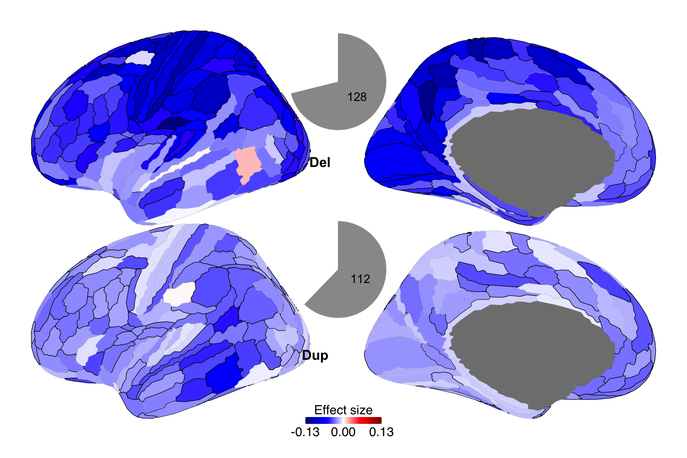
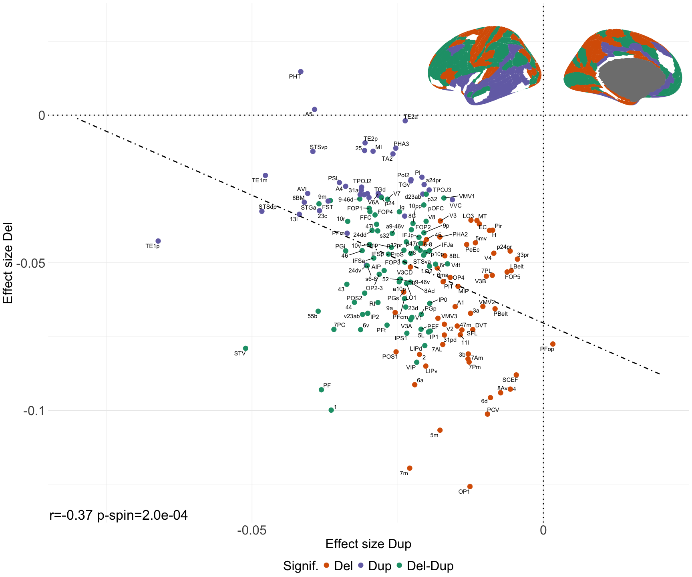

Fig2
================

## Fig. 2: Cortical maps of deletion and duplication effect sizes on cognitive ability

#### – Figure legend –

Legend: a) Maps of deletion and duplication effect sizes in 180 cortical
regions. We performed CC-GSBA for each cortical region, running 180
separate linear models. The color-coded effect sizes represent the
average effect of genes with high expression in each region on Z-scored
cognitive ability, mapped onto the cortex for both deletions and
duplications. Regions with significant effects are outlined in black
(p\<0.05, Bonferroni corrected). The gray pie charts show the proportion
of regions with significant effects; these include 128 regions for
deletions and 112 regions for duplications. b) Negative correlation
between the effect sizes of deletions and duplications across the cortex
(spin permutation p-value =2e-4). Each point is the mean effect size in
the cortical regions. X-axis: duplication; Y-axis: deletion effect
sizes, respectively. Only deletion or duplication significant effects
are plotted, and corresponding significant regions are shown as a
brain-plot in the top right corner.

#### Libraries

``` r
#### R libraries
library(ggplot2)
library(ggprism)
library(grid)
library(ggpubr)
library(ggrepel)
library(tidyr)
library(tibble)
library(dplyr)
```

    ## 
    ## Attaching package: 'dplyr'

    ## The following objects are masked from 'package:stats':
    ## 
    ##     filter, lag

    ## The following objects are masked from 'package:base':
    ## 
    ##     intersect, setdiff, setequal, union

``` r
library(here)
```

    ## here() starts at /Users/kuldeepkumar/Documents/Projects/Temp_CNV_GWAS_oct2022/SSDN_Manuscript/code_GitHub

``` r
library(matrixStats)
```

    ## 
    ## Attaching package: 'matrixStats'

    ## The following object is masked from 'package:dplyr':
    ## 
    ##     count

``` r
library(ggseg)    ## ggseg package for brainmaps
library(ggsegGlasser)
library(patchwork)
library(cowplot)
```

    ## 
    ## Attaching package: 'cowplot'

    ## The following object is masked from 'package:patchwork':
    ## 
    ##     align_plots

    ## The following object is masked from 'package:ggpubr':
    ## 
    ##     get_legend

``` r
in_fig_lab_size <- 20
venn_txt_size <- 8
legend_txt_size <- 20
```

#### Data: CC-GSBA results, effectsize, se & pvalue

``` r
### data-frame with all results 
load(file = here::here("data","data_CC_GSBA_output.RData"))

data_Fig2 = data_CC_GSBA_output[which(data_CC_GSBA_output$gene_set_exp_category == "All_data_analysis_fig2"),]
```

#### Functions

``` r
#--------------------------------------------------------------------------------
# Function to make single Brain projection map -------
fBrainMap_cortex_estimate_pvalue <- function(array_es,array_pval,cbar_min=-1,cbar_max=1,in_legtitle,in_atlas_name){
  
  ## ROI names from ggseg palette
    pallete_ggseg = glasser$palette 
    ggseg_region_names <- names(pallete_ggseg)[c(1:180)] # keep LH only
  
  # p-value cut-off for ROI boundary color
  cutoff_Pvalue = 0.05
  
  # Max value limit: keep estimates within cbar limit (# limit estimate values to max and min range for comparison)
  array_es[array_es > cbar_max] <- cbar_max
  array_es[array_es < cbar_min] <- cbar_min
  
  # create df with estimate and p-value
  temp_df_es_pval <- as.data.frame(cbind(array_es,array_pval))
  temp_df_es_pval$pval_log10 <- -0.25*log10(array_pval) #-0.12*log10(array_pval) # multiply by 0.05 => 4 will be 0.2
  temp_df_es_pval[temp_df_es_pval$pval_log10 > 0.5,"pval_log10"] <- 0.5 #0.15   # Max line width: any log10 p-value larger than 0.15 should be set at 0.15 (else lines are thick)
  colnames(temp_df_es_pval) <- c("est","pval","pval_log10")   # column names for df
  
  ## region boundary color: Create columns for color and thickness based on the pvalue
   temp_df_es_pval$sig_col <- ifelse(temp_df_es_pval$pval>cutoff_Pvalue, "grey", "black")    # significnace color
  
  # region boundaries: minimum thickness
  temp_df_es_pval$sig_thick <- as.numeric(ifelse(temp_df_es_pval$pval>cutoff_Pvalue, "0.25", temp_df_es_pval$pval_log10))
  
  # Create data tibble with "region" column
  someData <- tibble(
    region = ggseg_region_names, 
    effect = temp_df_es_pval[,"est"],
    pval = temp_df_es_pval[,"pval"],
    sig_col = temp_df_es_pval[,"sig_col"],
    sig_thick = temp_df_es_pval[,"sig_thick"]
  )
  
  p_left <-  ggseg(someData,
                   atlas = in_atlas_name,
                   position="dispersed",
                   hemisphere = "left",
                   mapping =aes(fill = effect,colour = I(sig_col),
                                size = I(sig_thick)),
                   adapt_scales = TRUE) +
    theme_brain(text.family = "sans",text.size = 14) + # "monospace") +
    scale_fill_gradientn(limits = c(cbar_min,cbar_max),breaks=c(cbar_min,0,cbar_max),
                         colours = alpha(colorRampPalette(c("blue4","blue","white","red","red4"))(n = 300), alpha = 1)) +
    theme(legend.position = "bottom") +  
    guides(fill = guide_colourbar(title = in_legtitle,
                                  title.position = "top", #"left", # Legend title below bar
                                  barwidth = 10,  # Extend bar length
                                  barheight =0.9,
                                  title.hjust =0.5,
                                  title.vjust = 0)) +
    theme(legend.margin=margin(t = 0, unit='cm'))+
    theme(legend.title=element_text(size=24), 
          legend.text=element_text(size=24))
  
  # extract legend
  p_legend <- p_left
  cowplot_legend <- cowplot::get_legend(p_legend)
  
  # Remove legend and any other labels + remove some space around top and bottom 
  p_left <- p_left + theme(legend.position = "none")
  p_single_plot <- p_left + theme(axis.title = element_blank(),axis.text.x = element_blank()) + theme(plot.margin=grid::unit(c(-20,0,-20,0), "mm"))  
  
  # return single plot and legend
  list_plot_and_legend <- list(p_single_plot,cowplot_legend)
  
  return(list_plot_and_legend)
}

#--------------------------------------------------------------------------------
# Function to plot Del-sig; Dup-sig; Del-Dup-sig; and "not-sig" ROI brain map
fCore_roi_set_overlap_del_dup <- function(pval_set1,pval_set2,pvalThres,input_array_cat_labels){
  
  # function to make a brian map for Core Signif. ROI set
  
  for(loop_d in c(1:2)){
    if(loop_d ==1){
      in_pval_mat <- pval_set1 #pval_DUP #
    } else{
      in_pval_mat <- pval_set2 #
    }
    
    mat_pval_binary <- in_pval_mat
    mat_pval_binary[mat_pval_binary > 0] <- 0
    mat_pval_binary[in_pval_mat < pvalThres] <- 1
    
    temp_colsum <- colSums(mat_pval_binary)
    temp_rowsum <- rowSums(mat_pval_binary)
    
    indx_core_set <- which(temp_rowsum == ncol(in_pval_mat))
    #----------------------------------------------------
    if(loop_d ==1){
      indx_core_set1 <- indx_core_set
    } else{
      indx_core_set2 <- indx_core_set
    }
    
  }
  
  # 2. Common ROI-set
  indx_core_set1_set2 <- intersect(indx_core_set1,indx_core_set2)  
  
  array_core_set <- rep(0,nrow(pval_set1))
  array_core_set[indx_core_set1] <- 1
  array_core_set[indx_core_set2] <- 2
  array_core_set[indx_core_set1_set2] <- 3
  
  #----------------------------------------------------------
  # plot
  pallete_ggseg_glasser = glasser$palette 
  ggseg_region_names <- names(pallete_ggseg_glasser)[c(1:180)] # keep LH only
  
  someData <- tibble(
    region = ggseg_region_names, 
    effect = array_core_set 
  )
  
  # define the colors for categories # match the scatterplot color code
  cols <- c("0" = "white", "1"="#D95F02","2"="#7570B3","3"="#1B9E77")
  
  
  p_left <-  ggseg(someData,
                   atlas = in_atlas_name,
                   position="dispersed",
                   hemisphere = "left",
                   mapping =aes(fill = effect,size=I(0.30)), 
                   size =0.01,
                   colour = "grey",
                   adapt_scales = TRUE) +
    theme_brain(text.family = "sans",text.size = 14) + # "monospace") +
    scale_fill_gradientn(limits = c(0,3),breaks=c(0,1,2,3),labels=input_array_cat_labels,
                         colours = colorRampPalette(c("white","#D95F02","#7570B3","#1B9E77"))(n = 4)) + 
    theme(legend.position = "bottom") +  
    guides(fill = guide_colourbar(title = 'Core Signif ROI set',
                                  title.position = "top", # Legend title below bar
                                  barwidth = 15,  # Extend bar length
                                  barheight =1,
                                  label.theme = element_text(angle = 0),
                                  title.hjust =0.5,
                                  title.vjust = 0)) +
    theme(legend.margin=margin(t = 0, unit='cm'))
  
  # Remove legend and any other labels + remove some space around top and bottom 
  p_left <- p_left + theme(legend.position = "none")
  p_single_plot <- p_left + theme(axis.title = element_blank(),axis.text.x = element_blank()) + theme(plot.margin=grid::unit(c(-20,0,-20,0), "mm"))  
  
  p_core_set <- p_single_plot + theme(legend.position = "bottom")
  
  return(p_core_set)
  
}


#---------------------------------------------------
# Function for computing spin permutaiton test based p-value (pre-computed rotations)
get_pspin_pvalue = function(x,y,perm_id,corr_type='pearson'){
  
  ### input "perm_id" are pre-computed null rotations 
  # number of regions
  nroi = dim(perm_id)[1]  
  # number of permutations
  nperm = dim(perm_id)[2] 
  
  # empirical correlation
  rho_emp = cor(x,y,method=corr_type)  
  
  # null profiles: permutation of measures
  x_perm = y_perm = array(NA,dim=c(nroi,nperm))
  for (r in 1:nperm) {
    for (i in 1:nroi) {
      x_perm[i,r] = x[perm_id[i,r]]
      y_perm[i,r] = y[perm_id[i,r]]
    }
  }
  
  # correlation with null profiles
  rho_null_xy = rho_null_yx = vector(length=nperm)
  for (r in 1:nperm) {
    rho_null_xy[r] = cor(x_perm[,r],y,method=corr_type)
    rho_null_yx[r] = cor(y_perm[,r],x,method=corr_type)
  }
  
  # Compute p-value depending on the sign of the empirical correlation
  if (rho_emp>0) {
    p_perm_xy = sum(rho_null_xy>rho_emp)/nperm
    p_perm_yx = sum(rho_null_yx>rho_emp)/nperm
  } else { 
    p_perm_xy = sum(rho_null_xy<rho_emp)/nperm
    p_perm_yx = sum(rho_null_yx<rho_emp)/nperm
  } 
  
  #average p-value
  pspin_avg <- (p_perm_xy+p_perm_yx)/2
  
  # check if p-value is 0; assign to 1/ number of null iterations
  if(pspin_avg == 0){
    pspin_avg = 1/nperm
  }
  
  # return spin permutaiton p-value
  return(pspin_avg)
  
}


#---------------------------------------------------
# Spin Perm: Get Perm-IDs for Select LH ROIs 
#---------------------------------------------------

rotate_parcellation_LHonly = function(coord.l,nrot=10000) {
  
  # check that coordinate dimensions are correct
  if (dim(coord.l)[1]==3) {
    print('transposing coordinates to be of dimension nROI x 3')
    coord.l = t(coord.l)
  }
  
  
  nroi.l = dim(coord.l)[1]   # n(regions) in the left hemisphere
  nroi = nroi.l
  
  perm.id = array(0,dim=c(nroi,nrot)); # initialise output array
  r = 0; c = 0; # count successful (r) and unsuccessful (c) iterations
  
  # UPDATED 16/10/2019 - set up updated permutation scheme 
  I1 = diag(3); I1[1,1] = -1;
  # main loop -  use of "while" is to ensure any rotation that maps to itself is excluded (this is rare, but can happen)
  while (r < nrot) {
    
    # UPDATED 16/10/2019
    A = matrix(rnorm(9, mean = 0, sd = 1), nrow = 3, ncol = 3)
    qrdec = qr(A)       # QR decomposition
    TL = qr.Q(qrdec)    # Q matrix
    temp = qr.R(qrdec)  # R matrix
    TL = TL%*%diag(sign(diag(temp)))
    if (det(TL)<0) {
      TL[,1] = -TL[,1]
    }
    # reflect across the Y-Z plane for right hemisphere
    TR = I1 %*% TL %*% I1;
    coord.l.rot = coord.l %*% TL; # transformed (rotated) left coordinates
    
    # after rotation, find "best" match between rotated and unrotated coordinates
    # first, calculate distance between initial coordinates and rotated ones
    dist.l = array(0,dim=c(nroi.l,nroi.l));
    
    # UPDATED 5/9/2019 - change of rotated variable name to "coord.l/r.rot" (from coord.l/r.rot.xyz)
    for (i in 1:nroi.l) { # left
      for (j in 1:nroi.l) {
        dist.l[i,j] = sqrt( sum( (coord.l[i,]-coord.l.rot[j,])^2 ) )
      }
    }
    
    # LEFT
    # calculate distances, proceed in order of "most distant minimum"
    # -> for each unrotated region find closest rotated region (minimum), then assign the most distant pair (maximum of the minima), 
    # as this region is the hardest to match and would only become harder as other regions are assigned
    temp.dist.l = dist.l
    rot.l = c(); ref.l = c();
    #tba.r = tba.c = 1:nroi.l # rows and columns that are yet "to be assigned"
    for (i in 1:nroi.l) {
      # max(min) (described above)
      ref.ix = which( rowMins(temp.dist.l,na.rm=T) == max(rowMins(temp.dist.l,na.rm=T),na.rm=T) )   # "furthest" row
      rot.ix = which( temp.dist.l[ref.ix,] == min(temp.dist.l[ref.ix,],na.rm=T) ) # closest region
      
      # # alternative option: mean of row - take the closest match for unrotated region that is on average furthest from rotated regions
      # ref.ix = which(nanmean(temp.dist.l,2)==nanmax(nanmean(temp.dist.l,2)))    # "furthest" row
      # rot.ix = which(temp.dist.l(ref.ix,:)==nanmin(temp.dist.l(ref.ix,:)))      # closest region    
      ref.l = c(ref.l,ref.ix) # store reference and rotated indices
      rot.l = c(rot.l,rot.ix)
      temp.dist.l[,rot.ix] = NA # set temporary column indices to NaN, to be disregarded in next iteration
      temp.dist.l[ref.ix,] = 0 # because in the above form of the code, R doesn't deal well with whole rows and columns of NaN, set row to low value (which won't matter as furthest rows are assigned first)
      #temp.dist.l[,rot.ix] = NA # set temporary indices to NaN, to be disregarded in next iteration
      #temp.dist.l[ref.ix,] = NA
    }
    
    # mapping is x->y
    # collate vectors from both hemispheres + sort mapping according to "reference" vector
    ref.lr = c(ref.l); rot.lr = c(rot.l);
    b = sort(ref.lr,index.return=T); 
    ref.lr.sort = ref.lr[b$ix]; rot.lr.sort = rot.lr[b$ix];
    
    # verify that permutation worked (output should be vector with values 1:nroi = 1:(nroi_l+nroi_r))
    if (!all(sort(rot.lr.sort,decreasing=F)==c(1:nroi))) {
      #save.image('~/Desktop/perm_error.RData')
      browser("permutation error")
    }
    
    # avoid permutation that map to itself
    if (!all(rot.lr.sort==c(1:nroi))) {
      r = r+1
      perm.id[,r] = rot.lr.sort # if it doesn't, store it
    } else {
      c = c+1
      print(paste('map to itself n. ',toString(c),sep=''))
    }
    
  }
  
  return(perm.id)
  
}


#---------------------------------------------------
# Get Permuted-IDs for a given set of ROI-indices for Glasser
fGet_perm_ids_input_ROI_indices_GlasserLH = function(input_LH_ROI_indices,nIterNull = 10000){
  
  ### Read the Glasser 180 region coordinates (sphere)
  sphere_HCP <- read.table(here::here("data","sphere_HCP.txt"), quote="\"", comment.char="")
  
  #coord.l = as.matrix(sphere_HCP[c(1:180),])
  coord.l = as.matrix(sphere_HCP[input_LH_ROI_indices,])
  
  # call function to get permuted IDs
  perm.id.LH.select =rotate_parcellation_LHonly(coord.l,nrot=nIterNull) 
  
  return(perm.id.LH.select)
}


#--------------------------------------------------------------------------
# Compute correlation with two given maps: subset of ROIs
fGet_corr_pvalue_spin_test_two_maps_selectROIs <- function(array_es_1,array_es_2,select_LH_ROI_indices,corr_type='pearson',nIterNull){
  
  # Get perm_IDs
  df_perm_ids= fGet_perm_ids_input_ROI_indices_GlasserLH(select_LH_ROI_indices,nIterNull)
  
  temp_cor = cor(array_es_1,array_es_2,method=corr_type)  # empirical correlation
  
  # spin test
  temp_pvalue = get_pspin_pvalue(array_es_1,array_es_2,df_perm_ids,corr_type) 
  
  res_cor_pval <- list(temp_cor,temp_pvalue)
  
  return(res_cor_pval)
}

#--------------------------------------------------------------------------------
#----function to adjust for p-value in matrix format-------
fPval_adj_in_mat <- function(in_pval_mat,padj_method='fdr'){
  
  # p.adjust.methods: c("holm", "hochberg", "hommel", "bonferroni", "BH", "BY","fdr", "none")
  in_pval_mat_FDR <- matrix(p.adjust(as.vector(as.matrix(in_pval_mat)), method=padj_method),ncol=ncol(in_pval_mat))
  
  return(in_pval_mat_FDR)
}
```

#### Fig 2A: Maps of deletion and duplication effect sizes in 180 cortical regions.

``` r
## Effect sizes: 180 linear model regression estimates
array_es_DEL <- data_Fig2[which(data_Fig2$cnv_type == "DEL"),"Estimate"]
array_es_DUP <- data_Fig2[which(data_Fig2$cnv_type == "DUP"),"Estimate"]

## p-values: 180 linear model regression p-values
array_pval_DEL <- data_Fig2[which(data_Fig2$cnv_type == "DEL"),"pvalue"]
array_pval_DUP <- data_Fig2[which(data_Fig2$cnv_type == "DUP"),"pvalue"]

## Apply multiple-comparisons correction across DEL and DUP p-values
padj_method= "bonferroni"  # # c("holm", "hochberg", "hommel", "bonferroni", "BH", "BY","fdr", "none")

in_pval_mat <- cbind(array_pval_DEL,array_pval_DUP)
in_pval_mat_FDR <- fPval_adj_in_mat(in_pval_mat,padj_method)
array_pval_DEL_adj<- in_pval_mat_FDR[,1]
array_pval_DUP_adj <- in_pval_mat_FDR[,2]

## Glasser brain 180 ROI names
ggseg_pallete <- glasser$palette
ggseg_region_names <- names(ggseg_pallete)[c(1:180)] # keep LH only
array_ROInames <- paste0("L_",gsub("-",".",ggseg_region_names))
  
#----------------------------------------------------------------------
# PART A: pie charts for n-sig ROIs for Del and dup
#----------------------------------------------------------------------

## Set theme for pie-charts
blank_theme <- theme_minimal()+
  theme(
    axis.title.x = element_blank(),
    axis.title.y = element_blank(),
    panel.border = element_blank(),
    panel.grid=element_blank(),
    axis.ticks = element_blank(),
    plot.title=element_text(size=14, face="bold")
  )

# DEL pie-chart of number of (Bonferroni) significant regions 
n_sig = length(which(array_pval_DEL_adj< 0.05))
n_ns = length(array_pval_DEL) - n_sig
df_pie_sig = data.frame(x=c("ns","sig"),
                        y=c(n_ns,n_sig),
                        in_label = c("",n_sig))
                       
df_pie_sig[,"x"] = factor(df_pie_sig[,"x"],levels = c("ns","sig"))

p_pie_del_sig = ggplot(df_pie_sig, aes(x="",y=y,fill=x))+
  blank_theme + 
  geom_bar(stat="identity", width=1) +
  coord_polar("y", start=0) +
  theme(axis.text.x=element_blank())+
  geom_text(aes(label = in_label), position = position_stack(vjust=0.5),size=venn_txt_size,check_overlap = TRUE) +
  labs(x = NULL, y = NULL,  fill = NULL)+ 
  theme(legend.position = "none")+
  scale_fill_manual(values=c("white","#999999")) 

  
# DUP pie-chart of number of (Bonferroni) significant regions  
n_sig = length(which(array_pval_DUP_adj < 0.05))
n_ns = length(array_pval_DUP_adj) - n_sig
df_pie_sig = data.frame(x=c("ns","sig"),
                        y=c(n_ns,n_sig),
                        in_label = c("",n_sig))

df_pie_sig[,"x"] = factor(df_pie_sig[,"x"],levels = c("ns","sig"))

p_pie_dup_sig = ggplot(df_pie_sig, aes(x="",y=y,fill=x))+
  blank_theme + 
  geom_bar(stat="identity", width=1) +
  coord_polar("y", start=0) +
  theme(axis.text.x=element_blank())+
  geom_text(aes(label = in_label), position = position_stack(vjust=0.5),size=venn_txt_size,check_overlap = TRUE) +
  labs(x = NULL, y = NULL,  fill = NULL)+ 
  theme(legend.position = "none")+
  scale_fill_manual(values=c("white","#999999"))

#----------------------------------------------------------------------
# PArt B: brain maps of effect sizes + p-values (boundary of ROIs) using ggseg
#----------------------------------------------------------------------

in_atlas_name = "glasser"

## Set legend title
in_legtitle = "Effect size" #'Estimate' #'Est' #'Estimate'

## Set the Color-bar range
temp_es_range = 0.13
in_cbar_min = -1*temp_es_range
in_cbar_max = temp_es_range

# call funciton to make effect size brain map for DEL
list_plots <- fBrainMap_cortex_estimate_pvalue(array_es_DEL,array_pval_DEL_adj,in_cbar_min,in_cbar_max,in_legtitle,in_atlas_name)
```

    ## merging atlas and data by 'region'

``` r
p_map_DEL <- list_plots[[1]]


# call funciton to make effect size brain map for DUP
list_plots <- fBrainMap_cortex_estimate_pvalue(array_es_DUP,array_pval_DUP_adj,in_cbar_min,in_cbar_max,in_legtitle,in_atlas_name)
```

    ## merging atlas and data by 'region'

``` r
p_map_DUP <- list_plots[[1]] 
brainmap_colorbar_DUP <- list_plots[[2]]  ## Color-bar for effect sizes


### Stack Del and Dup effect size brain maps + add labels
p_map_DEL_DUP <- ggarrange(p_map_DEL,NULL,p_map_DUP,ncol = 1,
                           labels = c("Del","","Dup"),
                           font.label = list(face="bold",size =26),
                           heights = c(0.8,-0.2,0.8),
                           label.x=c(0.435,0.42,0.42),  ## custom label position
                           label.y = c(0.41,0.42,0.41), ## custom label position
                           common.legend=FALSE) 

## add single color-bar for effect sizes to the stacked del-dup brainmpas
p_map_DEL_DUP_legend = ggarrange(p_map_DEL_DUP,NULL,brainmap_colorbar_DUP,
                                 heights = c(0.6,-0.09,0.1),ncol=1)


### ADD pie charts to the brain maps

## add Del pie chart
p_map_plus_pie_del = p_map_DEL_DUP_legend + annotation_custom(ggplotGrob(p_pie_del_sig), 
                                                              xmin = 0.29, xmax = 0.69, 
                                                              ymin = 0.68, ymax = 0.96)

## add Dup pie chart 
p_map_plus_pie_del_dup = p_map_plus_pie_del + annotation_custom(ggplotGrob(p_pie_dup_sig), 
                                                                xmin = 0.29, xmax = 0.69, 
                                                                ymin = 0.27, ymax = 0.55)
    
### Fig 2 panel A
print(p_map_plus_pie_del_dup)
```

<!-- -->

#### Fig 2B. correlation between the effect sizes of Del and Dup across the cortex

``` r
## apply shrinkage ==> consider ROIs that are significant for either Del or Dup
in_pval_thres <- 0.05

array_pval_DEL_binary <- array_pval_DEL_adj
array_pval_DEL_binary[array_pval_DEL_adj>= in_pval_thres] <- 0
array_pval_DEL_binary[array_pval_DEL_adj< in_pval_thres] <- 1

array_pval_DUP_binary <- array_pval_DUP_adj
array_pval_DUP_binary[array_pval_DUP_adj >= in_pval_thres] <- 0
array_pval_DUP_binary[array_pval_DUP_adj < in_pval_thres] <- 1
  
### Array with 4 categories of significance between Del and Dup
array_sig_DEL_DUP <- rep("ns",length(array_pval_DEL))
array_sig_DEL_DUP[ (array_pval_DEL_binary == 1) & (array_pval_DUP_binary == 1)] <- "Del-Dup"  
array_sig_DEL_DUP[ (array_pval_DEL_binary == 1) & (array_pval_DUP_binary == 0)] <- "Del"
array_sig_DEL_DUP[ (array_pval_DEL_binary == 0) & (array_pval_DUP_binary == 1)] <- "Dup"

### Get count of del, dup, sig
summary(as.factor(array_sig_DEL_DUP))
```

    ##     Del Del-Dup     Dup      ns 
    ##      54      74      38      14

``` r
100*summary(as.factor(array_sig_DEL_DUP))/180
```

    ##       Del   Del-Dup       Dup        ns 
    ## 30.000000 41.111111 21.111111  7.777778

``` r
#--------------------------------------------------------
## Scatter plot

## set plot parameters
in_x_label <- "Effect size Dup" #"Estimate DUP"
in_y_label <- "Effect size Del" # "Estimate DEL"
in_leg_shape_label <- "sig-ROIs"

## Create data frame for scatter plot 
df_scatter_input <- data.frame(cbind(expnames = ggseg_region_names, 
                                     array_es_DEL = array_es_DEL,
                                     array_es_DUP = array_es_DUP,
                                     array_sig_DEL_DUP = array_sig_DEL_DUP)) 
# Shrinkage: remove no-sig ROIs 
df_scatter_input <- df_scatter_input[df_scatter_input[,"array_sig_DEL_DUP"] != "ns",]
  
## Factor levels: "Del","Dup","Del-Dup"
df_scatter_input$array_sig_DEL_DUP <- factor(df_scatter_input$array_sig_DEL_DUP,levels = c("Del","Dup","Del-Dup"))
 
## Ensure the estimates are numeric. 
df_scatter_input[,"array_es_DUP"] <- as.numeric(df_scatter_input[,"array_es_DUP"])
df_scatter_input[,"array_es_DEL"] <- as.numeric(df_scatter_input[,"array_es_DEL"])


#---------------------------------------------------------
# Spin-permutation test: accounting for auto-correlation between brain regions


# Compute Spin-Perm test: Select ROIs
##---NOTE: Time consuming step: 20+ minutes as null permutations are generated -----##

# select_LH_ROI_indices = which(array_sig_DEL_DUP != "ns")
# res_corr_list <- fGet_corr_pvalue_spin_test_two_maps_selectROIs(df_scatter_input[,"array_es_DEL"],df_scatter_input[,"array_es_DUP"],select_LH_ROI_indices,'pearson',nIterNull=10000)
# cor_DEL_DUP <- res_corr_list[[1]]
# pspin_DEL_DUP <- res_corr_list[[2]]
# 
# print(cor_DEL_DUP)
# print(pspin_DEL_DUP)

#------- Use pre-computed values (output of above code) --------- ##
cor_DEL_DUP <- -0.37 #res_corr_list[[1]]
pspin_DEL_DUP <- 0.0002  # p-spin (limit of number of permutations)

temp_corr_label <- paste0("r=",round(cor_DEL_DUP,2)," p-spin=",sprintf("%s",formatC(pspin_DEL_DUP, digits = 1,format = "e")))
  
## Set color code
cols <- c("Del" = "#D95F02","Dup" = "#7570B3","Del-Dup" = "#1B9E77")   
  
## Scatter plot x-axis: Dup effect sizes; y-axis: Del effect sizes;
##              each point = one cortical region 


p_scatter_del_dup <- ggplot(df_scatter_input, 
                            aes(x=array_es_DUP, y=array_es_DEL, label = expnames)) +
  theme_minimal()+
  geom_point(aes(color = array_sig_DEL_DUP),size=4,alpha = 1) + 
  geom_text_repel()+
  scale_color_manual("Signif.",values = cols) +
  geom_smooth(method = "lm",se=FALSE,linetype="dotdash",fullrange=TRUE,color = "black")+
  geom_hline(yintercept=0,lwd=1,linetype="dotted") +
  geom_vline(xintercept=0,lwd=1,linetype="dotted") +
  scale_x_continuous(limits = c(-0.08,0.02),breaks = c(-0.05,0),labels = c(-0.05,0))+
  scale_y_continuous(limits = c(-0.13,0.03),breaks = c(-0.1,-0.05,0),
                     labels = c(-0.1,-0.05,0))+
  theme(text = element_text(size=24), axis.text.x =element_text(size=24),
        axis.text.y =element_text(size=24))+
  theme(legend.position = "bottom", #c(-0.1,0.01), 
        legend.direction = "horizontal")+ #"vertical")+ # 
  theme(legend.text = element_text(size = 24)) + 
  annotate("text",x=-Inf,y=-Inf,hjust=-0.01,vjust=-0.3,label=temp_corr_label,size=9)+  # bottom left
  xlab(in_x_label)+
  ylab(in_y_label)

  
## Brain map for 4 categories of Del-Dup signifiance 
##       ==> Regions that are significant for both del and dup, either del/dup, and none

pval_set1 <- cbind(array_pval_DEL_adj,array_pval_DEL_adj)
pval_set2 <- cbind(array_pval_DUP_adj,array_pval_DUP_adj)
pvalThres <- 0.05
input_array_cat_labels <- c("ns","DEL","DUP","DEL-DUP")
p_map_core_set <- fCore_roi_set_overlap_del_dup(pval_set1,pval_set2,pvalThres,input_array_cat_labels)
```

    ## merging atlas and data by 'region'

``` r
p_map_core_set = p_map_core_set + theme(legend.position = "none")


# Stacked plot: Scatter-plot and brain-map for significance groups
  p_scatter_plus_CoreROIs = p_scatter_del_dup + annotation_custom(ggplotGrob(p_map_core_set),
                                                                  xmin = -0.022, xmax = 0.026,
                                                                  ymin = -0.002, ymax = 0.035)
  
## Fig 2B.
print(p_scatter_plus_CoreROIs)
```

    ## `geom_smooth()` using formula = 'y ~ x'

<!-- -->
