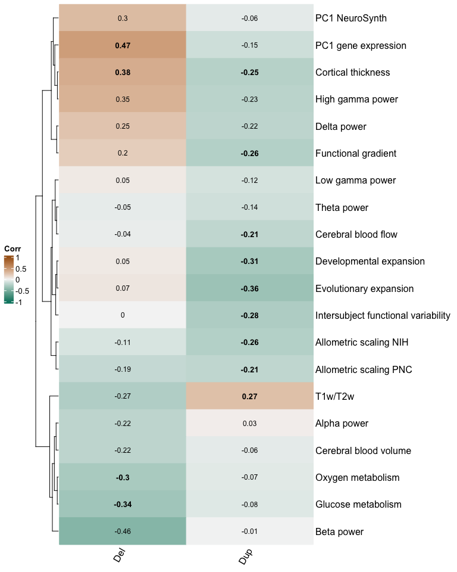
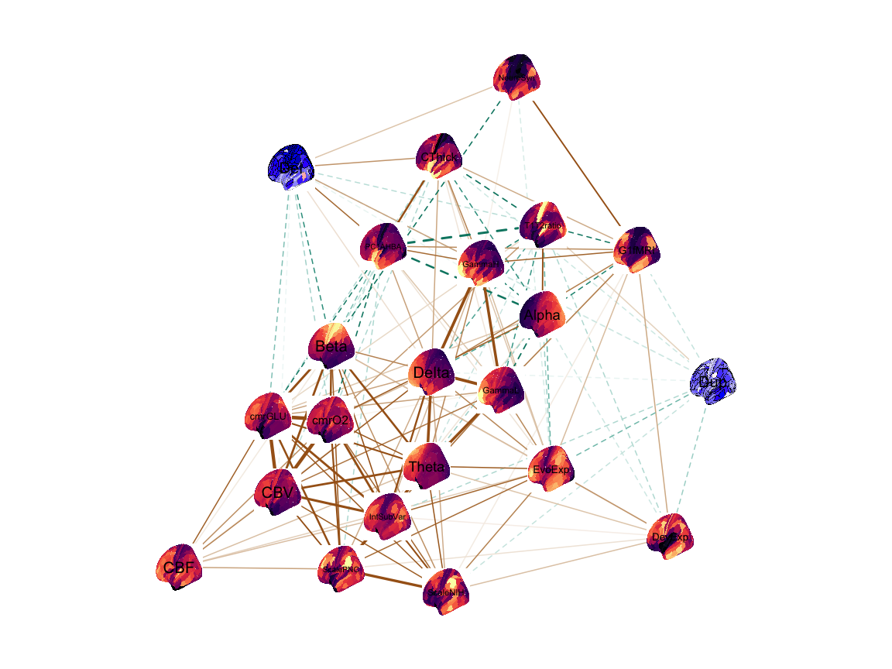
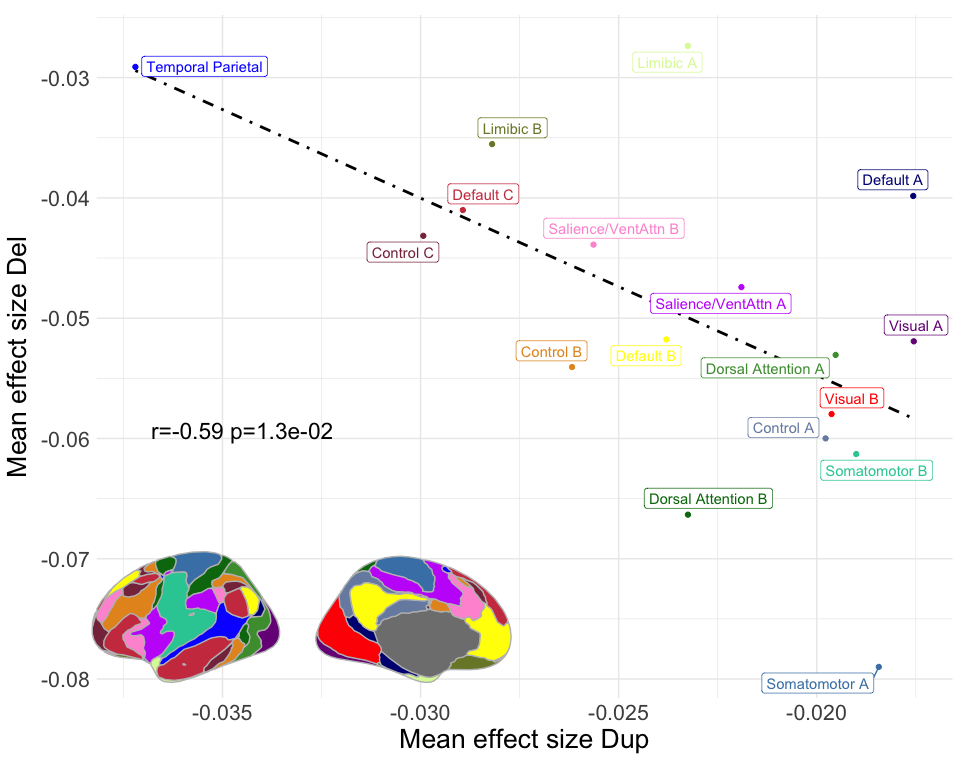

Fig3
================

## Fig. 3: Deletion and duplication effect size maps align with sensorimotor-association cortical organization hierarchy

#### – Figure legend –

Legend: a) Decoding the deletion and duplication effect size maps with
20 distinct neural maps. The heatmap shows the spatial correlation
between CNV effect size maps and 20 neuro-maps. Bold indicates
significant spatial correlations (FDR-adjusted p-spin \< 0.05). These
normative cortical maps include two microstructural (cortical thickness,
T1w/T2w), four metabolic (cerebral blood flow, cerebral blood volume,
glucose metabolism, oxygen metabolism), three functional (functional
gradient, PC1 NeuroSynth, intersubject functional variability), four
expansion (evolutionary and developmental expansion, and allometric
scaling NIH/PNC), six electrophysiological (alpha, beta, delta, low
gamma, high gamma, theta), and one bulk transcriptomics (PC1 gene
expression). The maps were obtained from the neuromaps toolbox and
transformed to the Glasser parcellation. b) Spring embedding
representation of the correlation matrix, showing FDR significant edges.
The deletion and duplication maps, and the 20 neuro-maps, are shown as
nodes. Positive and negative correlations are represented as solid and
dotted lines. c) Resting state functional networks based decoding of the
gene dosage effects across Yeo brain networks. To characterize the
spatial patterns of effect sizes, we mapped 180 cortical regions to the
17 Yeo brain networks. This involved computing the mean effect size for
each network, represented by a single point on the scatter plot. The
dashed line shows the negative correlation between the mean effect sizes
of deletions and duplications. The brain map in the bottom left outlines
the 17 brain networks. We used the open-source BrainStat toolbox for
resting state contextualization.

#### Libraries

``` r
#### R libraries
library(ggplot2)
library(ggprism)
library(grid)
library(ggpubr)
library(ggrepel)
library(tidyr)
library(tibble)
library(dplyr)
```

    ## 
    ## Attaching package: 'dplyr'

    ## The following objects are masked from 'package:stats':
    ## 
    ##     filter, lag

    ## The following objects are masked from 'package:base':
    ## 
    ##     intersect, setdiff, setequal, union

``` r
library(here)
```

    ## here() starts at /Users/kuldeepkumar/Documents/Projects/Temp_CNV_GWAS_oct2022/SSDN_Manuscript/code_GitHub

``` r
library(ggseg)    ## ggseg package
library(ggsegGlasser)
library(ggsegYeo2011)

library(patchwork)
library(cowplot)
```

    ## 
    ## Attaching package: 'cowplot'

    ## The following object is masked from 'package:patchwork':
    ## 
    ##     align_plots

    ## The following object is masked from 'package:ggpubr':
    ## 
    ##     get_legend

``` r
library(ComplexHeatmap)
```

    ## ========================================
    ## ComplexHeatmap version 2.14.0
    ## Bioconductor page: http://bioconductor.org/packages/ComplexHeatmap/
    ## Github page: https://github.com/jokergoo/ComplexHeatmap
    ## Documentation: http://jokergoo.github.io/ComplexHeatmap-reference
    ## 
    ## If you use it in published research, please cite either one:
    ## - Gu, Z. Complex Heatmap Visualization. iMeta 2022.
    ## - Gu, Z. Complex heatmaps reveal patterns and correlations in multidimensional 
    ##     genomic data. Bioinformatics 2016.
    ## 
    ## 
    ## The new InteractiveComplexHeatmap package can directly export static 
    ## complex heatmaps into an interactive Shiny app with zero effort. Have a try!
    ## 
    ## This message can be suppressed by:
    ##   suppressPackageStartupMessages(library(ComplexHeatmap))
    ## ========================================

``` r
library(circlize)
```

    ## ========================================
    ## circlize version 0.4.16
    ## CRAN page: https://cran.r-project.org/package=circlize
    ## Github page: https://github.com/jokergoo/circlize
    ## Documentation: https://jokergoo.github.io/circlize_book/book/
    ## 
    ## If you use it in published research, please cite:
    ## Gu, Z. circlize implements and enhances circular visualization
    ##   in R. Bioinformatics 2014.
    ## 
    ## This message can be suppressed by:
    ##   suppressPackageStartupMessages(library(circlize))
    ## ========================================

``` r
library(viridis)
```

    ## Loading required package: viridisLite

``` r
library(qgraph)  ## NOTE: qgraph is needed for spring embedding
library(png)
 
in_fig_lab_size <- 20
venn_txt_size <- 8
legend_txt_size <- 20
stats_font_size <- 5
```

#### Functions

``` r
#--------------------------------------------------------------------------------
#Function to make single Brain projection map: input NeuroMaps -------
fBrainPlot_ggseg_Cortex_array_SAmap_single_plot <- function(array_map_score,cbar_min=-3,cbar_max=3,in_legtitle,in_atlas_name){
  
## ROI names from ggseg palette
    pallete_ggseg = glasser$palette 
    ggseg_region_names <- names(pallete_ggseg)[c(1:180)] # keep LH only
    
  # Max value limit: keep estimates within cbar limit (# limit estimate values to max and min range for comparison)
  array_map_score[array_map_score > cbar_max] <- cbar_max
  array_map_score[array_map_score < cbar_min] <- cbar_min
  
  # create df with estimate and p-value
  temp_df <- as.data.frame(cbind(array_map_score))
  colnames(temp_df) <- c("map_score")
  
  # Create data tibble with "region" column
  someData <- tibble(
    region = ggseg_region_names, 
    effect = temp_df[,"map_score"]
  )
  
  p_left <-  ggseg(someData,
                   atlas = in_atlas_name,
                   position="dispersed",
                   hemisphere = "left",
                   mapping =aes(fill = effect,size=I(0.3)), 
                   adapt_scales = TRUE) +
    theme_brain(text.family = "sans",text.size = 14) + 
    scale_fill_viridis(limits = c(cbar_min,cbar_max),option="plasma") +
    theme(legend.position = "bottom") +  
    guides(fill = guide_colourbar(title = in_legtitle,
                                  title.position = "left", # Legend title below bar
                                  barwidth = 7,  # Extend bar length
                                  barheight =0.7,
                                  title.hjust =1,
                                  title.vjust = 0.9)) +
    theme(legend.margin=margin(t = 0, unit='cm'))
  
  # extract legend
  p_legend <- p_left
  cowplot_legend <- cowplot::get_legend(p_legend)
  
  # Remove legend and any other labels + remove some space around top and bottom 
  p_left <- p_left + theme(legend.position = "none")
  p_single_plot <- p_left + theme(axis.title = element_blank(),axis.text.x = element_blank()) + theme(plot.margin=grid::unit(c(-20,0,-20,0), "mm")) 
  
  p_single_plot_annot <- ggarrange(p_single_plot,NULL,ncol = 1,
                           labels = c(in_legtitle,""),
                           font.label = list(face="bold",size =16),
                           common.legend=FALSE) 
  
  # return single plot and legend
  list_plot_and_legend <- list(p_single_plot_annot,cowplot_legend)
  
  return(list_plot_and_legend)
}


fBrainMap_cortex_estimate_pvalue <- function(array_es,array_pval,cbar_min=-1,cbar_max=1,in_legtitle,in_atlas_name){
  
  ## ROI names from ggseg palette
    pallete_ggseg = glasser$palette 
    ggseg_region_names <- names(pallete_ggseg)[c(1:180)] # keep LH only
  
  # p-value cut-off for ROI boundary color
  cutoff_Pvalue = 0.05
  
  # Max value limit: keep estimates within cbar limit (# limit estimate values to max and min range for comparison)
  array_es[array_es > cbar_max] <- cbar_max
  array_es[array_es < cbar_min] <- cbar_min
  
  # create df with estimate and p-value
  temp_df_es_pval <- as.data.frame(cbind(array_es,array_pval))
  temp_df_es_pval$pval_log10 <- -0.25*log10(array_pval) #-0.12*log10(array_pval) # multiply by 0.05 => 4 will be 0.2
  temp_df_es_pval[temp_df_es_pval$pval_log10 > 0.5,"pval_log10"] <- 0.5 #0.15   # Max line width: any log10 p-value larger than 0.15 should be set at 0.15 (else lines are thick)
  colnames(temp_df_es_pval) <- c("est","pval","pval_log10")   # column names for df
  
  ## region boundary color: Create columns for color and thickness based on the pvalue
   temp_df_es_pval$sig_col <- ifelse(temp_df_es_pval$pval>cutoff_Pvalue, "grey", "black")    # significnace color
  
  # region boundaries: minimum thickness
  temp_df_es_pval$sig_thick <- as.numeric(ifelse(temp_df_es_pval$pval>cutoff_Pvalue, "0.25", temp_df_es_pval$pval_log10))
  
  # Create data tibble with "region" column
  someData <- tibble(
    region = ggseg_region_names, 
    effect = temp_df_es_pval[,"est"],
    pval = temp_df_es_pval[,"pval"],
    sig_col = temp_df_es_pval[,"sig_col"],
    sig_thick = temp_df_es_pval[,"sig_thick"]
  )
  
  p_left <-  ggseg(someData,
                   atlas = in_atlas_name,
                   position="dispersed",
                   hemisphere = "left",
                   mapping =aes(fill = effect,colour = I(sig_col),
                                size = I(sig_thick)),
                   adapt_scales = TRUE) +
    theme_brain(text.family = "sans",text.size = 14) + # "monospace") +
    scale_fill_gradientn(limits = c(cbar_min,cbar_max),breaks=c(cbar_min,0,cbar_max),
                         colours = alpha(colorRampPalette(c("blue4","blue","white","red","red4"))(n = 300), alpha = 1)) +
    theme(legend.position = "bottom") +  
    guides(fill = guide_colourbar(title = in_legtitle,
                                  title.position = "top", #"left", # Legend title below bar
                                  barwidth = 10,  # Extend bar length
                                  barheight =0.9,
                                  title.hjust =0.5,
                                  title.vjust = 0)) +
    theme(legend.margin=margin(t = 0, unit='cm'))+
    theme(legend.title=element_text(size=24), 
          legend.text=element_text(size=24))
  
  # extract legend
  p_legend <- p_left
  cowplot_legend <- cowplot::get_legend(p_legend)
  
  # Remove legend and any other labels + remove some space around top and bottom 
  p_left <- p_left + theme(legend.position = "none")
  p_single_plot <- p_left + theme(axis.title = element_blank(),axis.text.x = element_blank()) + theme(plot.margin=grid::unit(c(-20,0,-20,0), "mm"))  
  
  # return single plot and legend
  list_plot_and_legend <- list(p_single_plot,cowplot_legend)
  
  return(list_plot_and_legend)
}

#---------------------------------------------------
#function to adjust for p-value in matrix format-------
fPval_adj_in_mat <- function(in_pval_mat,padj_method='fdr'){
  
  # p.adjust.methods: c("holm", "hochberg", "hommel", "bonferroni", "BH", "BY","fdr", "none")
  in_pval_mat_FDR <- matrix(p.adjust(as.vector(as.matrix(in_pval_mat)), method=padj_method),ncol=ncol(in_pval_mat))
  
  return(in_pval_mat_FDR)
}

#--------------------------------------------------------------
# Function: fdr tril_mat and replicate

fFDR_tril_pval_mat <- function(mat_pval,padj_method='fdr'){
  # script to apply FDR on lower tril mat and mirror it (for symmetric matrix)
  
  p_mat_FDR <- mat_pval
  p_mat_tril <- lower.tri(p_mat_FDR, diag = FALSE)
  p_mat_triu <- upper.tri(p_mat_FDR, diag = FALSE)
  
  tril_p <- as.vector(p_mat_FDR[p_mat_tril])
  triu_p <- as.vector(p_mat_FDR[p_mat_triu])
  #padj_method= 'fdr'  #"bonferroni" #"none" #'fdr'  # # c("holm", "hochberg", "hommel", "bonferroni", "BH", "BY","fdr", "none")
  tril_p_FDR <- p.adjust(tril_p, method=padj_method)
  triu_p_FDR <- p.adjust(triu_p, method=padj_method)
  p_mat_FDR[p_mat_tril] <- tril_p_FDR
  p_mat_FDR[p_mat_triu] <- triu_p_FDR
  
  return(p_mat_FDR)
}


#---------------------------------------------------
# Function for computing correlation and parametric P-value 
cor_mtest <- function(mat, ...) {
  mat <- as.matrix(mat)
  n <- ncol(mat)
  p.mat<- matrix(NA, n, n)
  corr.mat<- matrix(NA, n, n)
  diag(p.mat) <- 0
  diag(corr.mat) <- 1
  for (i in 1:(n - 1)) {
    for (j in (i + 1):n) {
      tmp <- cor.test(mat[, i], mat[, j], ...)
      p.mat[i, j] <- p.mat[j, i] <- tmp$p.value
      corr.mat[i,j] <- corr.mat[j, i] <- tmp$estimate[[1]]
    }
  }
  colnames(p.mat) <- rownames(p.mat) <- colnames(mat)
  colnames(corr.mat) <- rownames(corr.mat) <- colnames(mat)
  
  res_list <- list(corr.mat,p.mat)
  
  return(res_list)
}

#---------------------------------------------------
# Function for computing spin permutaiton test based p-value (pre-computed rotations)

get_pspin_pvalue = function(x,y,perm_id,corr_type='pearson'){
  
  ### input "perm_id" are pre-computed null rotations 
  # number of regions
  nroi = dim(perm_id)[1]  
  # number of permutations
  nperm = dim(perm_id)[2] 
  
  # empirical correlation
  rho_emp = cor(x,y,method=corr_type)  
  
  # null profiles: permutation of measures
  x_perm = y_perm = array(NA,dim=c(nroi,nperm))
  for (r in 1:nperm) {
    for (i in 1:nroi) {
      x_perm[i,r] = x[perm_id[i,r]]
      y_perm[i,r] = y[perm_id[i,r]]
    }
  }
  
  # correlation with null profiles
  rho_null_xy = rho_null_yx = vector(length=nperm)
  for (r in 1:nperm) {
    rho_null_xy[r] = cor(x_perm[,r],y,method=corr_type)
    rho_null_yx[r] = cor(y_perm[,r],x,method=corr_type)
  }
  
  # Compute p-value depending on the sign of the empirical correlation
  if (rho_emp>0) {
    p_perm_xy = sum(rho_null_xy>rho_emp)/nperm
    p_perm_yx = sum(rho_null_yx>rho_emp)/nperm
  } else { 
    p_perm_xy = sum(rho_null_xy<rho_emp)/nperm
    p_perm_yx = sum(rho_null_yx<rho_emp)/nperm
  } 
  
  #average p-value
  pspin_avg <- (p_perm_xy+p_perm_yx)/2
  
  # check if p-value is 0; assign to 1/ number of null iterations
  if(pspin_avg == 0){
    pspin_avg = 1/nperm
  }
  
  # return spin permutaiton p-value
  return(pspin_avg)
  
}


#---------------------------------------------------
# Function to compute correlation + spin permutation pvalue for 2 input profiles
fCompute_Cor_profile1_vs_profile1_pspin <- function(profile1,profile2,in_atlas_name,corr.type='pearson'){
  
  # load pre-computed perm.ids for spin permutation test: "df_perm_ids_LH"
  load(file = here::here("data","df_perm_ids_GlasserLH180_nIterNull_10000.RData"))
  
  # get empirical corr
  rho.emp = cor(profile1,profile2,method=corr.type)  # empirical correlation
  
  # get parametric test based p-value
  res_corr_list <- cor_mtest(as.matrix(cbind(profile1,profile2)))
  temp_pvalue_param <- res_corr_list[[2]][1,2]
  
  # get spin test based p-value
  temp_pvalue_spin = get_pspin_pvalue(profile1,profile2,df_perm_ids_LH,corr_type) 
  
  
  array_cor_pval <- c(rho.emp,temp_pvalue_spin,temp_pvalue_param)
  
  return(array_cor_pval)
}


#---------------------------------------------------
# Function to get mean effect size estimates for Yeo networks (see BrainStat Toolbox for reference)
fEstimate_Glasser180_to_Yeo_RSN_mean_sem <- function(input_es,input_yeo_rsn_n=17){
  
  load(file = here::here("data","Fig3_input_df_SAmaps_plus_NeuroMaps.RData"))

  # read Glasser ROIs to fsaverage5 vertex mapping
  Glasser360_regions_mapped_to_fsaverage5 <- read.table(file = here::here("data","Fig3_input_Glasser360_regions_mapped_to_fsaverage5.txt"), quote="\"", comment.char="",stringsAsFactors = FALSE)
  
  temp_GlasserLH_to_fs5 = Glasser360_regions_mapped_to_fsaverage5[c(1:(nrow(Glasser360_regions_mapped_to_fsaverage5)/2)),1]
  
  # read yeo17 or yeo7 to fsaverage mapping
  yeo_networks_mapped_to_fsaverage5 <- read.table(file = here::here("data",paste0("Fig3_input_yeo",input_yeo_rsn_n,"_networks_mapped_to_fsaverage5.txt")), quote="\"", comment.char="",stringsAsFactors = FALSE)
  yeo_rsnLH_to_fs5 = yeo_networks_mapped_to_fsaverage5[c(1:(nrow(yeo_networks_mapped_to_fsaverage5)/2)),1]
  
  # map estimates to fsavaerge5
  #est_fs5 = rep(NA,length(temp_GlasserLH_to_fs5))
  input_es = c(NA,input_es)
  est_fs5 = input_es[(temp_GlasserLH_to_fs5+1)]
  yeo_rsn= yeo_rsnLH_to_fs5
  # Now compute mean and standard error of mean for each of the network
  df_est_yeo_fs5 = data.frame(est_fs5 = est_fs5,
                              yeo_rsn= yeo_rsnLH_to_fs5)
  
  
  df_mean_sem_yeo_rsn <- aggregate(est_fs5 ~ yeo_rsn, 
                                   df_est_yeo_fs5, function(x) c(mean = mean(x), sem = sd(x) / sqrt(length(x))))
  # aggregate gives two column as output; convert to df
  df_mean_sem_yeo_rsn = cbind(df_mean_sem_yeo_rsn[-ncol(df_mean_sem_yeo_rsn)], df_mean_sem_yeo_rsn[[ncol(df_mean_sem_yeo_rsn)]])
  
  # remove background network
  df_mean_sem_yeo_rsn = as.data.frame(df_mean_sem_yeo_rsn[c(2:nrow(df_mean_sem_yeo_rsn)),])
  
  # simplify column names
  colnames(df_mean_sem_yeo_rsn) = c("yeo_rsn","mean","sem")
  
  return(df_mean_sem_yeo_rsn)
  
}


#--------------------------------------------------------------
# Function: make Corrplot using ComplexHeatmap

fCorHeatmap_single_mat_Apr2023_RectAllData <- function(mat_corr,mat_pval,mat_pval_FDR,array_names){
  
  nm = array_names
  M <- as.matrix(mat_corr)
  M_round <- as.matrix(round(mat_corr,2))
  pMat <- as.matrix(mat_pval)
  pMat_FDR <- as.matrix(mat_pval_FDR)
  
  # ------- temp_labels ------  star for p-FDR------
  mat_labels_Corr_Pval_stars <- matrix(data=NA,nrow=nrow(pMat_FDR),ncol=ncol(pMat_FDR))
  for( loop_row in c(1:nrow(pMat_FDR))){
    for( loop_col  in c(1:ncol(pMat_FDR))){
      temp_label <- round(mat_corr[loop_row,loop_col],2)
      mat_labels_Corr_Pval_stars[loop_row,loop_col] <- temp_label
    }
  }
  
  #-------------------------------------------------------
  # heatmap parameters
  in_angle_rot_column_names <- 60
  flag_dendogram <- FALSE
  in_fontsize_stars <- 8
  in_name_fontsize = 12
  
  # Color function for the HeatMap
  col_fun = circlize::colorRamp2(c(-1, 0, 1), c("#018571", "#f5f5f5", "#a6611a")) 
  
  ## Heatmap
  ht = Heatmap(M_round, name = "Corr", rect_gp = gpar(type = "none"),
               row_names_max_width = unit(24, "cm"),
               cluster_rows = TRUE, cluster_columns = FALSE,
               column_names_rot = in_angle_rot_column_names,
               column_names_gp = grid::gpar(fontsize = in_name_fontsize),
               row_names_gp = grid::gpar(fontsize = in_name_fontsize),
               row_names_side = "right",
               col = col_fun,
               # add * for p-value using cell_fun
               cell_fun = function(j, i, x, y, width, height, fill) {
                 #if(i >= j) {
                 grid.rect(x = x, y = y, width = width, height = height, 
                           gp = gpar(col = fill, fill = fill))
                 if( pMat_FDR[i, j] < 0.05 ){
                   grid.text(sprintf("%s",mat_labels_Corr_Pval_stars[i,j]), x, y, gp = gpar(fontsize = in_fontsize_stars+2, fontface = "bold",col = "black"))   
                 } else {
                   grid.text(sprintf("%s",mat_labels_Corr_Pval_stars[i,j]), x, y, gp = gpar(fontsize = in_fontsize_stars+1, fontface = "plain",col = "black"))   
                 }
               }, show_column_dend = flag_dendogram, show_row_dend = TRUE,
               row_title = NULL, column_title = NULL
  )
  
  
  lgd = Legend(col_fun = col_fun, title = "Corr.",at = c(-1, 0, 1), 
               labels = c("-1", "0", "1"))  
  
  lgd_horiz = Legend(col_fun = col_fun, title = "Corr.", direction = "horizontal",
                     title_position = "topcenter",
                     legend_height = unit(2, "cm"),legend_width = unit(4, "cm"))  
  
  list_plots =  list(ht,lgd,lgd_horiz)
  
  return(list_plots)
}
```

#### Input CC-GSBA results :effectsize, se & pvalue

``` r
load(file = here::here("data","data_CC_GSBA_output.RData"))

## Main analysis effect size profiles
data_Fig2 = data_CC_GSBA_output[which(data_CC_GSBA_output$gene_set_exp_category == "All_data_analysis_fig2"),]

## Effect sizes: 180 linear model regression estimates
array_es_DEL <- data_Fig2[which(data_Fig2$cnv_type == "DEL"),"Estimate"]
array_es_DUP <- data_Fig2[which(data_Fig2$cnv_type == "DUP"),"Estimate"]

## p-values: 180 linear model regression p-values
array_pval_DEL <- data_Fig2[which(data_Fig2$cnv_type == "DEL"),"pvalue"]
array_pval_DUP <- data_Fig2[which(data_Fig2$cnv_type == "DUP"),"pvalue"]

## Apply multiple-comparisons correction across DEL and DUP p-values
padj_method= "bonferroni"  # # c("holm", "hochberg", "hommel", "bonferroni", "BH", "BY","fdr", "none")

in_pval_mat <- cbind(array_pval_DEL,array_pval_DUP)
in_pval_mat_FDR <- fPval_adj_in_mat(in_pval_mat,padj_method)
array_pval_DEL_adj<- in_pval_mat_FDR[,1]
array_pval_DUP_adj <- in_pval_mat_FDR[,2]

## Glasser brain 180 ROI names
ggseg_pallete <- glasser$palette
ggseg_region_names <- names(ggseg_pallete)[c(1:180)] # keep LH only
array_ROInames <- paste0("L_",gsub("-",".",ggseg_region_names))
```

#### Fig 3A: Heatmap: decoding the deletion and duplication effect size maps with 20 distinct neural maps.

``` r
## NeuroMaps for Glasser Brain
load(file = here::here("data","Fig3_input_df_SAmaps_plus_NeuroMaps.RData"))

df_select_maps = df_SAmaps_plus_NeuroMaps

## Computing correlations: satck Del & Dup profiles with 20 neuromaps
df_stacked_maps = cbind(array_es_DEL,array_es_DUP,df_select_maps)

# names(df_stacked_maps_v2)= c("Del","Dup","G1fMRI","T1T2ratio","EvoExp","CBF","CThick","PC1AHBA",
#                           "NeuroSyn","CBV","cmrO2","cmrGLU","DevExp","IntSubVar",
#                         "Alpha","Beta","Delta","GammaL","GammaH","Theta",
#                         "ScaleNIH","ScalePNC")

names(df_stacked_maps)= c("Del","Dup","Functional gradient",
                             "T1w/T2w","Evolutionary expansion","Cerebral blood flow",
                             "Cortical thickness","PC1 gene expression",
                             "PC1 NeuroSynth","Cerebral blood volume",
                             "Oxygen metabolism","Glucose metabolism",
                             "Developmental expansion","Intersubject functional variability",
                             "Alpha power","Beta power",
                             "Delta power","Low gamma power",
                             "High gamma power","Theta power",
                             "Allometric scaling NIH","Allometric scaling PNC")


res_cor = cor_mtest(df_stacked_maps)

temp_cor_all = res_cor[[1]]
temp_pval_all = res_cor[[2]]
cor_Del_Dup_vs_neuromaps = as.data.frame(round(temp_cor_all[c(3:22),c(1,2)],3))
pval_cor_Del_Dup_vs_neuromaps = as.data.frame(temp_pval_all[c(3:22),c(1,2)])
pval_cor_Del_Dup_vs_neuromaps = fFDR_tril_pval_mat(pval_cor_Del_Dup_vs_neuromaps,padj_method='fdr')


# ### Spin permutation p-value
# load(file = here::here("data","df_perm_ids_GlasserLH180_nIterNull_10000.RData"))
# 
# p_value_matrix <- as.data.frame(matrix(
#   data = NA, nrow = (ncol(df_stacked_maps)-2),ncol =  2,
#   dimnames = list(
#     names(df_stacked_maps)[c(3:22)], # Row names
#     names(df_stacked_maps)[c(1,2)]  # Column names
#   )
# ))
# 
# corr_type = 'pearson'
# 
# for( i in c(1:2)){
#   profile1 = df_stacked_maps[,i]
#   for( j in c(3:22)){
#     profile2 = df_stacked_maps[,j]
#     temp_pvalue_spin = get_pspin_pvalue(profile1,profile2,df_perm_ids_LH,corr_type) 
#     
#     p_value_matrix[j-2,i] = temp_pvalue_spin
#   }
# }
# 
# pspin_cor_Del_Dup_vs_neuromaps = as.data.frame(p_value_matrix)
# pspin_cor_Del_Dup_vs_neuromaps_FDR = fFDR_tril_pval_mat(pspin_cor_Del_Dup_vs_neuromaps,padj_method='fdr')
#
# save(cor_Del_Dup_vs_neuromaps,
#      pval_cor_Del_Dup_vs_neuromaps,pval_cor_Del_Dup_vs_neuromaps,
#      pspin_cor_Del_Dup_vs_neuromaps,pspin_cor_Del_Dup_vs_neuromaps_FDR,file = paste0("data/Fig3a_data_cor_pval_pspin.RData"))

### Load pre-computed (above section) spin permutation p-values
load(file = here::here("data","Fig3a_data_cor_pval_pspin.RData"))

## Heatmap input: correlation matrix + pvalue
mat_corr  = cor_Del_Dup_vs_neuromaps
mat_pval = pspin_cor_Del_Dup_vs_neuromaps
mat_pval_FDR = pspin_cor_Del_Dup_vs_neuromaps_FDR
array_names = names(df_stacked_maps)
list_plots_ht = fCorHeatmap_single_mat_Apr2023_RectAllData(mat_corr,mat_pval,mat_pval_FDR,array_names)
ht = list_plots_ht[[1]]
lgd = list_plots_ht[[2]]
lgd_horiz = list_plots_ht[[3]]

### Fig 3 panel A
draw(ht,heatmap_legend_side="left")
```

<!-- --> \#### Fig 3B.
Spring embedding representation of the correlation with NeuroMaps \####

``` r
df_select_maps <- df_SAmaps_plus_NeuroMaps

temp_Array_map_names = c("G1fMRI","T1T2ratio","EvoExp","CBF","CThick","PC1AHBA",
                         "NeuroSyn","CBV","cmrO2","cmrGLU","DevExp","IntSubVar",
                      "Alpha","Beta","Delta","GammaL","GammaH","Theta",
                      "ScaleNIH","ScalePNC")

print("Optional: Visualize 20 Neuromaps")
```

    ## [1] "Optional: Visualize 20 Neuromaps"

``` r
list_plot_NeuroMaps <- vector(mode = "list", length = ncol(df_select_maps))
  
### Optional: Visualize each of the NeuroMaps
for(i in c(1:ncol(df_select_maps))){
  
  array_map_score <- scale(df_select_maps[,i])
  
  in_atlas_name = "glasser"
   in_cbar_min = -2
    in_cbar_max = 2 
    in_legtitle <- temp_Array_map_names[i]
    
    list_plots <- fBrainPlot_ggseg_Cortex_array_SAmap_single_plot(array_map_score,in_cbar_min,in_cbar_max,in_legtitle,in_atlas_name)
    
    p_map_neuromaps<- list_plots[[1]]
    ##brainmap_colorbar <- list_plots[[2]]
    #print(p_map_neuromaps)
    
    list_plot_NeuroMaps[[i]] = p_map_neuromaps
}
```

    ## merging atlas and data by 'region'
    ## merging atlas and data by 'region'
    ## merging atlas and data by 'region'
    ## merging atlas and data by 'region'
    ## merging atlas and data by 'region'
    ## merging atlas and data by 'region'
    ## merging atlas and data by 'region'
    ## merging atlas and data by 'region'
    ## merging atlas and data by 'region'
    ## merging atlas and data by 'region'
    ## merging atlas and data by 'region'
    ## merging atlas and data by 'region'
    ## merging atlas and data by 'region'
    ## merging atlas and data by 'region'
    ## merging atlas and data by 'region'
    ## merging atlas and data by 'region'
    ## merging atlas and data by 'region'
    ## merging atlas and data by 'region'
    ## merging atlas and data by 'region'
    ## merging atlas and data by 'region'

``` r
p_neuromaps_stacked = ggarrange(plotlist = list_plot_NeuroMaps, nrow = 5,ncol = 4)

print(p_neuromaps_stacked)
```

<!-- -->

``` r
##----------------------------
### Spring embedding

## Get cropped images for SA-maps

array_all_map_names = c("Del","Dup","G1fMRI","T1T2ratio","EvoExp","CBF","CThick","PC1AHBA",
                          "NeuroSyn","CBV","cmrO2","cmrGLU","DevExp","IntSubVar",
                          "Alpha","Beta","Delta","GammaL","GammaH","Theta","ScaleNIH","ScalePNC")


image_png_files = here::here("data","Fig3_input_Images_NeuroMaps_cropped",paste0(array_all_map_names,".png"))

### Qgrpah ref
# REF: https://cran.r-project.org/web/packages/qgraph/qgraph.pdf
# REF: https://reisrgabriel.com/blog/2021-08-21-qgraph-exhaustive/

## Q-graph node aspect ratio
aspect_ratio <- 500 / 350 
base_size <- 4

node_vsize <- base_size * aspect_ratio 
node_vsize2 <- base_size # Base size for height

## 3B. Spring embedding
qgraph(cor(df_stacked_maps,method="pearson"),graph="cor", 
       theme = 'colorblind', negCol = "#018571", posCol = "#a6611a",
       images = image_png_files,
       borders = FALSE,
       layout="spring",repulsion=1,aspect = TRUE,
       labels=array_all_map_names,negDashed = TRUE,maximum=0.15,
       esize=3,edge.labels=FALSE,
       alpha=0.05,minimum='sig',threshold="fdr",sampleSize=100,
       vsize = node_vsize, 
       vsize2 = node_vsize2) 
```

<!-- -->

#### Fig 3C. Resting state functional networks based decoding of the gene dosage effects across Yeo brain networks

``` r
input_yeo_rsn_n=17

# Estimates to Yeo RSN mean and sem
df_mean_sem_yeoRSN_DEL = fEstimate_Glasser180_to_Yeo_RSN_mean_sem(array_es_DEL,input_yeo_rsn_n)
df_mean_sem_yeoRSN_DUP = fEstimate_Glasser180_to_Yeo_RSN_mean_sem(array_es_DUP,input_yeo_rsn_n)


#-------------------
# get color palette for Yeo RSN from ggseg
if( input_yeo_rsn_n == 17){
  ggseg_yeo_palette = ggsegYeo2011::yeo17$palette
} else {
  ggseg_yeo_palette = ggsegYeo2011::yeo7$palette
}

yeoRSN_labels = names(ggseg_yeo_palette)
barplot_fill_cols = unname(ggseg_yeo_palette)

#--------------------------------------
# Yeo RSN networks

if( input_yeo_rsn_n == 17){
  brainmap_yeo_rsn <- ggseg(atlas = yeo17,
                            position="dispersed",
                            hemisphere = "left",
                            mapping=aes(fill=region), 
                            colour="grey",size=.5,
                            adapt_scales = TRUE) +
    theme(axis.title = element_blank(),
          axis.text.x = element_blank(),
          axis.ticks.x = element_blank(),
          axis.text.y = element_blank(),
          axis.ticks.y = element_blank())+
    theme(legend.position = "none")+
    theme_brain(text.family = "sans",text.size = 14)  +
    scale_fill_manual(values = ggseg_yeo_palette)
  
} else {
  brainmap_yeo_rsn <- ggseg(atlas = yeo7,
                            position="dispersed",
                            hemisphere = "left",
                            mapping=aes(fill=region), 
                            colour="grey",size=.5,
                            adapt_scales = TRUE) +
    theme(axis.title = element_blank(),
          axis.text.x = element_blank(),
          axis.ticks.x = element_blank(),
          axis.text.y = element_blank(),
          axis.ticks.y = element_blank())+
    theme(legend.position = "none")+
    theme_brain(text.family = "sans",text.size = 14)  +
    scale_fill_manual(values = ggseg_yeo_palette)
}

input_df_scatter = data.frame(yeo_rsn = df_mean_sem_yeoRSN_DEL$yeo_rsn,
                              mean_DEL = df_mean_sem_yeoRSN_DEL$mean,
                              mean_DUP = df_mean_sem_yeoRSN_DUP$mean,
                              label_rsn=yeoRSN_labels)

# parametric test
res_corr_list <- cor_mtest(as.matrix(cbind(input_df_scatter[,"mean_DEL"],input_df_scatter[,"mean_DUP"])),method = "pearson")
temp_cor_DEL_DUP <- res_corr_list[[1]][1,2]
temp_pvalue_DEL_DUP <- res_corr_list[[2]][1,2]

## Label: Correlation + p-value 
temp_corr_label <- paste0("r=",round(temp_cor_DEL_DUP,2)," p=",sprintf("%s",formatC(temp_pvalue_DEL_DUP, digits = 1,format = "e")))


## Factor Yeo networks
input_df_scatter$yeo_rsn = factor(input_df_scatter$yeo_rsn,levels = c(1:input_yeo_rsn_n))
in_x_label = "Mean effect size Dup"
in_y_label = "Mean effect size Del"

## Scater plot: Mean effect size Del vs Dup across Yeo brain networks
p_scatter = ggplot(data=input_df_scatter,aes(y=mean_DEL,x=mean_DUP,color=yeo_rsn,label=label_rsn))+
  theme_minimal()+  
  geom_smooth(method = "lm",se=FALSE,linetype="dotdash",fullrange=TRUE,color = "black")+
  geom_point()+ geom_label_repel()+
  scale_color_manual(values = barplot_fill_cols) + theme(legend.position = "none")+
  annotate("text",x=-Inf,y=-0.06,hjust=-0.3,vjust=0.02,label=temp_corr_label,size=(stats_font_size+1))+
  xlab(in_x_label)+ ylab(in_y_label)+
  theme(text = element_text(size = 20)) 


### Add the brain-map for Yeo networks to the scatter plot
p_scatter_annot = p_scatter + annotation_custom(ggplotGrob(brainmap_yeo_rsn), 
                                                xmin = -0.039, xmax = -0.027, 
                                                ymin = -0.085, ymax = -0.065) 

p_yeo_rsn_col = ggarrange(NULL,p_scatter_annot,NULL,
                          ncol=1,
                          heights = c(0.01,1,0.01))
```

    ## `geom_smooth()` using formula = 'y ~ x'

``` r
## Fig 3C.
print(p_yeo_rsn_col)
```

<!-- -->
