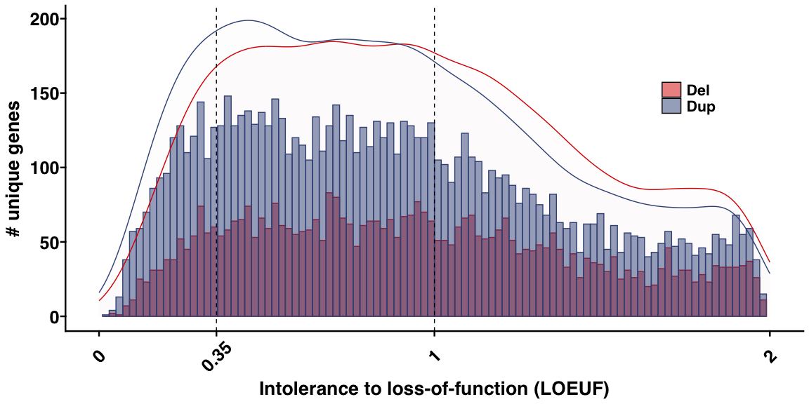
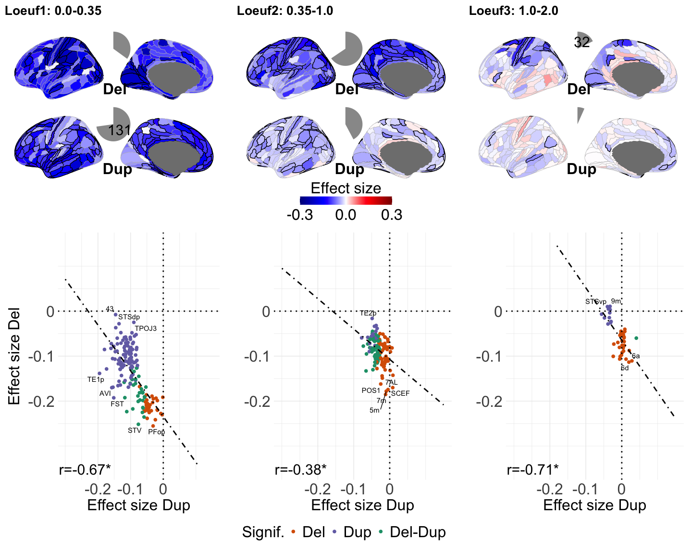

Fig5
================

## Fig. 5: Genetic constraint and gene dosage cortical maps

#### – Figure legend –

Legend: a) Histogram showing the distribution of the number of genes
deleted or duplicated at least once in our dataset, with respect to
their genetic constraint (intolerance to loss of function; LOEUF25
values). Deletions and duplications are in red and blue. X-axis: 100
bins of LOEUF values. Density curves are added to compare the densities
between deletions and duplications. b) Genes stratified into three LOEUF
categories: i) highly intolerant (Loeuf1: 0-0.35); ii) intolerant
(Loeuf2: 0.35-1.0); and iii) tolerant (Loeuf3: 1.0-2.0). Barplot showing
the number (#) of unique genes observed in deletions and duplications in
our data, for the three LOEUF categories. c) Cognitive ability effect
size maps of deletions and duplications for the three LOEUF categories.
Regions with significant effect sizes have black edges (Bonferroni
p-value \< 0.05). Grey edges are not significant. Pie charts show the
number and proportion of significant cortical regions. The color scale
shows the mean effect size of deletion or duplication on cognitive
ability (Z-score) in that cortical region of interest. d) Negative
correlation between the effect sizes of deletions and duplications
across the cortex (\*: FDR adjusted spin permutation p-value \< 0.05.
Each point is the mean effect size in the cortical regions.

#### Libraries

``` r
#### R libraries
library(ggplot2)
library(ggprism)
library(grid)
library(ggpubr)
library(ggrepel)
library(tidyr)
library(tibble)
library(dplyr)
```

    ## 
    ## Attaching package: 'dplyr'

    ## The following objects are masked from 'package:stats':
    ## 
    ##     filter, lag

    ## The following objects are masked from 'package:base':
    ## 
    ##     intersect, setdiff, setequal, union

``` r
library(matrixStats)
```

    ## 
    ## Attaching package: 'matrixStats'

    ## The following object is masked from 'package:dplyr':
    ## 
    ##     count

``` r
library(Rmisc)
```

    ## Loading required package: lattice

    ## Loading required package: plyr

    ## ------------------------------------------------------------------------------

    ## You have loaded plyr after dplyr - this is likely to cause problems.
    ## If you need functions from both plyr and dplyr, please load plyr first, then dplyr:
    ## library(plyr); library(dplyr)

    ## ------------------------------------------------------------------------------

    ## 
    ## Attaching package: 'plyr'

    ## The following object is masked from 'package:matrixStats':
    ## 
    ##     count

    ## The following objects are masked from 'package:dplyr':
    ## 
    ##     arrange, count, desc, failwith, id, mutate, rename, summarise,
    ##     summarize

    ## The following object is masked from 'package:ggpubr':
    ## 
    ##     mutate

``` r
library(effsize)

library(ggseg)    ## ggseg package for brainmaps
library(ggsegGlasser)
library(patchwork)
library(cowplot)
```

    ## 
    ## Attaching package: 'cowplot'

    ## The following object is masked from 'package:patchwork':
    ## 
    ##     align_plots

    ## The following object is masked from 'package:ggpubr':
    ## 
    ##     get_legend

``` r
library(here)
```

    ## here() starts at /Users/kuldeepkumar/Documents/Projects/Temp_CNV_GWAS_oct2022/SSDN_Manuscript/code_GitHub

    ## 
    ## Attaching package: 'here'

    ## The following object is masked from 'package:plyr':
    ## 
    ##     here

``` r
in_fig_lab_size <- 20
in_tag_size <- 20
venn_txt_size <- 8
legend_txt_size <- 20
in_txt_font_size <- 18
```

#### Data: CC-GSBA results, effectsize, se & pvalue

``` r
load(file = here::here("data","data_CC_GSBA_output.RData") )

data_Fig5_base = data_CC_GSBA_output[which(data_CC_GSBA_output$gene_set_exp_category == "genetic_constraint"),]

### # Regional specificity threshold Main analysis
array_loeuf_cat = c("genetic_constraint_loeuf_0p0_0p35", "genetic_constraint_loeuf_0p35_1p0","genetic_constraint_loeuf_1p0_2p0")

list_categorical_gene_sets <- c("Loeuf1: 0.0-0.35","Loeuf2: 0.35-1.0","Loeuf3: 1.0-2.0")

data_Fig5 = data_Fig5_base[which(data_Fig5_base$gene_set_exp %in% array_loeuf_cat),]
```

#### Functions

``` r
#--------------------------------------------------------------------------------
# Function to make single Brain projection map -------
fBrainMap_cortex_estimate_pvalue <- function(array_es,array_pval,cbar_min=-1,cbar_max=1,in_legtitle,in_atlas_name){
  
  ## ROI names from ggseg palette
    pallete_ggseg = glasser$palette 
    ggseg_region_names <- names(pallete_ggseg)[c(1:180)] # keep LH only
  
  # p-value cut-off for ROI boundary color
  cutoff_Pvalue = 0.05
  
  # Max value limit: keep estimates within cbar limit (# limit estimate values to max and min range for comparison)
  array_es[array_es > cbar_max] <- cbar_max
  array_es[array_es < cbar_min] <- cbar_min
  
  # create df with estimate and p-value
  temp_df_es_pval <- as.data.frame(cbind(array_es,array_pval))
  temp_df_es_pval$pval_log10 <- -0.25*log10(array_pval) #-0.12*log10(array_pval) # multiply by 0.05 => 4 will be 0.2
  temp_df_es_pval[temp_df_es_pval$pval_log10 > 0.5,"pval_log10"] <- 0.5 #0.15   # Max line width: any log10 p-value larger than 0.15 should be set at 0.15 (else lines are thick)
  colnames(temp_df_es_pval) <- c("est","pval","pval_log10")   # column names for df
  
  ## region boundary color: Create columns for color and thickness based on the pvalue
   temp_df_es_pval$sig_col <- ifelse(temp_df_es_pval$pval>cutoff_Pvalue, "grey", "black")    # significnace color
  
  # region boundaries: minimum thickness
  temp_df_es_pval$sig_thick <- as.numeric(ifelse(temp_df_es_pval$pval>cutoff_Pvalue, "0.25", temp_df_es_pval$pval_log10))
  
  # Create data tibble with "region" column
  someData <- tibble(
    region = ggseg_region_names, 
    effect = temp_df_es_pval[,"est"],
    pval = temp_df_es_pval[,"pval"],
    sig_col = temp_df_es_pval[,"sig_col"],
    sig_thick = temp_df_es_pval[,"sig_thick"]
  )
  
  p_left <-  ggseg(someData,
                   atlas = in_atlas_name,
                   position="dispersed",
                   hemisphere = "left",
                   mapping =aes(fill = effect,colour = I(sig_col),
                                size = I(sig_thick)),
                   adapt_scales = TRUE) +
    theme_brain(text.family = "sans",text.size = 14) + # "monospace") +
    scale_fill_gradientn(limits = c(cbar_min,cbar_max),breaks=c(cbar_min,0,cbar_max),
                         colours = alpha(colorRampPalette(c("blue4","blue","white","red","red4"))(n = 300), alpha = 1)) +
    theme(legend.position = "bottom") +  
    guides(fill = guide_colourbar(title = in_legtitle,
                                  title.position = "top", #"left", # Legend title below bar
                                  barwidth = 10,  # Extend bar length
                                  barheight =0.9,
                                  title.hjust =0.5,
                                  title.vjust = 0)) +
    theme(legend.margin=margin(t = 0, unit='cm'))+
    theme(legend.title=element_text(size=24), 
          legend.text=element_text(size=24))
  
  # extract legend
  p_legend <- p_left
  cowplot_legend <- cowplot::get_legend(p_legend)
  
  # Remove legend and any other labels + remove some space around top and bottom 
  p_left <- p_left + theme(legend.position = "none")
  p_single_plot <- p_left + theme(axis.title = element_blank(),axis.text.x = element_blank()) + theme(plot.margin=grid::unit(c(-20,0,-20,0), "mm"))  
  
  # return single plot and legend
  list_plot_and_legend <- list(p_single_plot,cowplot_legend)
  
  return(list_plot_and_legend)
}

#--------------------------------------------------------------------------------
# Function to plot Del-sig; Dup-sig; Del-Dup-sig; and "not-sig" ROI brain map
fCore_roi_set_overlap_del_dup <- function(pval_set1,pval_set2,pvalThres,input_array_cat_labels){
  
  # function to make a brian map for Core Signif. ROI set
  
  for(loop_d in c(1:2)){
    if(loop_d ==1){
      in_pval_mat <- pval_set1 #pval_DUP #
    } else{
      in_pval_mat <- pval_set2 #
    }
    
    mat_pval_binary <- in_pval_mat
    mat_pval_binary[mat_pval_binary > 0] <- 0
    mat_pval_binary[in_pval_mat < pvalThres] <- 1
    
    temp_colsum <- colSums(mat_pval_binary)
    temp_rowsum <- rowSums(mat_pval_binary)
    
    indx_core_set <- which(temp_rowsum == ncol(in_pval_mat))
    #----------------------------------------------------
    if(loop_d ==1){
      indx_core_set1 <- indx_core_set
    } else{
      indx_core_set2 <- indx_core_set
    }
    
  }
  
  # 2. Common ROI-set
  indx_core_set1_set2 <- intersect(indx_core_set1,indx_core_set2)  
  
  array_core_set <- rep(0,nrow(pval_set1))
  array_core_set[indx_core_set1] <- 1
  array_core_set[indx_core_set2] <- 2
  array_core_set[indx_core_set1_set2] <- 3
  
  #----------------------------------------------------------
  # plot
  pallete_ggseg_glasser = glasser$palette 
  ggseg_region_names <- names(pallete_ggseg_glasser)[c(1:180)] # keep LH only
  
  someData <- tibble(
    region = ggseg_region_names, 
    effect = array_core_set 
  )
  
  # define the colors for categories # match the scatterplot color code
  cols <- c("0" = "white", "1"="#D95F02","2"="#7570B3","3"="#1B9E77")
  
  
  p_left <-  ggseg(someData,
                   atlas = in_atlas_name,
                   position="dispersed",
                   hemisphere = "left",
                   mapping =aes(fill = effect,size=I(0.30)), 
                   size =0.01,
                   colour = "grey",
                   adapt_scales = TRUE) +
    theme_brain(text.family = "sans",text.size = 14) + # "monospace") +
    scale_fill_gradientn(limits = c(0,3),breaks=c(0,1,2,3),labels=input_array_cat_labels,
                         colours = colorRampPalette(c("white","#D95F02","#7570B3","#1B9E77"))(n = 4)) + 
    theme(legend.position = "bottom") +  
    guides(fill = guide_colourbar(title = 'Core Signif ROI set',
                                  title.position = "top", # Legend title below bar
                                  barwidth = 15,  # Extend bar length
                                  barheight =1,
                                  label.theme = element_text(angle = 0),
                                  title.hjust =0.5,
                                  title.vjust = 0)) +
    theme(legend.margin=margin(t = 0, unit='cm'))
  
  # Remove legend and any other labels + remove some space around top and bottom 
  p_left <- p_left + theme(legend.position = "none")
  p_single_plot <- p_left + theme(axis.title = element_blank(),axis.text.x = element_blank()) + theme(plot.margin=grid::unit(c(-20,0,-20,0), "mm"))  
  
  p_core_set <- p_single_plot + theme(legend.position = "bottom")
  
  return(p_core_set)
  
}


#---------------------------------------------------
# Function for computing spin permutaiton test based p-value (pre-computed rotations)
get_pspin_pvalue = function(x,y,perm_id,corr_type='pearson'){
  
  ### input "perm_id" are pre-computed null rotations 
  # number of regions
  nroi = dim(perm_id)[1]  
  # number of permutations
  nperm = dim(perm_id)[2] 
  
  # empirical correlation
  rho_emp = cor(x,y,method=corr_type)  
  
  # null profiles: permutation of measures
  x_perm = y_perm = array(NA,dim=c(nroi,nperm))
  for (r in 1:nperm) {
    for (i in 1:nroi) {
      x_perm[i,r] = x[perm_id[i,r]]
      y_perm[i,r] = y[perm_id[i,r]]
    }
  }
  
  # correlation with null profiles
  rho_null_xy = rho_null_yx = vector(length=nperm)
  for (r in 1:nperm) {
    rho_null_xy[r] = cor(x_perm[,r],y,method=corr_type)
    rho_null_yx[r] = cor(y_perm[,r],x,method=corr_type)
  }
  
  # Compute p-value depending on the sign of the empirical correlation
  if (rho_emp>0) {
    p_perm_xy = sum(rho_null_xy>rho_emp)/nperm
    p_perm_yx = sum(rho_null_yx>rho_emp)/nperm
  } else { 
    p_perm_xy = sum(rho_null_xy<rho_emp)/nperm
    p_perm_yx = sum(rho_null_yx<rho_emp)/nperm
  } 
  
  #average p-value
  pspin_avg <- (p_perm_xy+p_perm_yx)/2
  
  # check if p-value is 0; assign to 1/ number of null iterations
  if(pspin_avg == 0){
    pspin_avg = 1/nperm
  }
  
  # return spin permutaiton p-value
  return(pspin_avg)
  
}


#---------------------------------------------------
# Spin Perm: Get Perm-IDs for Select LH ROIs 
#---------------------------------------------------

rotate_parcellation_LHonly = function(coord.l,nrot=10000) {
  
  # check that coordinate dimensions are correct
  if (dim(coord.l)[1]==3) {
    print('transposing coordinates to be of dimension nROI x 3')
    coord.l = t(coord.l)
  }
  
  
  nroi.l = dim(coord.l)[1]   # n(regions) in the left hemisphere
  nroi = nroi.l
  
  perm.id = array(0,dim=c(nroi,nrot)); # initialise output array
  r = 0; c = 0; # count successful (r) and unsuccessful (c) iterations
  
  # UPDATED 16/10/2019 - set up updated permutation scheme 
  I1 = diag(3); I1[1,1] = -1;
  # main loop -  use of "while" is to ensure any rotation that maps to itself is excluded (this is rare, but can happen)
  while (r < nrot) {
    
    # UPDATED 16/10/2019
    A = matrix(rnorm(9, mean = 0, sd = 1), nrow = 3, ncol = 3)
    qrdec = qr(A)       # QR decomposition
    TL = qr.Q(qrdec)    # Q matrix
    temp = qr.R(qrdec)  # R matrix
    TL = TL%*%diag(sign(diag(temp)))
    if (det(TL)<0) {
      TL[,1] = -TL[,1]
    }
    # reflect across the Y-Z plane for right hemisphere
    TR = I1 %*% TL %*% I1;
    coord.l.rot = coord.l %*% TL; # transformed (rotated) left coordinates
    
    # after rotation, find "best" match between rotated and unrotated coordinates
    # first, calculate distance between initial coordinates and rotated ones
    dist.l = array(0,dim=c(nroi.l,nroi.l));
    
    # UPDATED 5/9/2019 - change of rotated variable name to "coord.l/r.rot" (from coord.l/r.rot.xyz)
    for (i in 1:nroi.l) { # left
      for (j in 1:nroi.l) {
        dist.l[i,j] = sqrt( sum( (coord.l[i,]-coord.l.rot[j,])^2 ) )
      }
    }
    
    # LEFT
    # calculate distances, proceed in order of "most distant minimum"
    # -> for each unrotated region find closest rotated region (minimum), then assign the most distant pair (maximum of the minima), 
    # as this region is the hardest to match and would only become harder as other regions are assigned
    temp.dist.l = dist.l
    rot.l = c(); ref.l = c();
    #tba.r = tba.c = 1:nroi.l # rows and columns that are yet "to be assigned"
    for (i in 1:nroi.l) {
      # max(min) (described above)
      ref.ix = which( rowMins(temp.dist.l,na.rm=T) == max(rowMins(temp.dist.l,na.rm=T),na.rm=T) )   # "furthest" row
      rot.ix = which( temp.dist.l[ref.ix,] == min(temp.dist.l[ref.ix,],na.rm=T) ) # closest region
      
      # # alternative option: mean of row - take the closest match for unrotated region that is on average furthest from rotated regions
      # ref.ix = which(nanmean(temp.dist.l,2)==nanmax(nanmean(temp.dist.l,2)))    # "furthest" row
      # rot.ix = which(temp.dist.l(ref.ix,:)==nanmin(temp.dist.l(ref.ix,:)))      # closest region    
      ref.l = c(ref.l,ref.ix) # store reference and rotated indices
      rot.l = c(rot.l,rot.ix)
      temp.dist.l[,rot.ix] = NA # set temporary column indices to NaN, to be disregarded in next iteration
      temp.dist.l[ref.ix,] = 0 # because in the above form of the code, R doesn't deal well with whole rows and columns of NaN, set row to low value (which won't matter as furthest rows are assigned first)
      #temp.dist.l[,rot.ix] = NA # set temporary indices to NaN, to be disregarded in next iteration
      #temp.dist.l[ref.ix,] = NA
    }
    
    # mapping is x->y
    # collate vectors from both hemispheres + sort mapping according to "reference" vector
    ref.lr = c(ref.l); rot.lr = c(rot.l);
    b = sort(ref.lr,index.return=T); 
    ref.lr.sort = ref.lr[b$ix]; rot.lr.sort = rot.lr[b$ix];
    
    # verify that permutation worked (output should be vector with values 1:nroi = 1:(nroi_l+nroi_r))
    if (!all(sort(rot.lr.sort,decreasing=F)==c(1:nroi))) {
      #save.image('~/Desktop/perm_error.RData')
      browser("permutation error")
    }
    
    # avoid permutation that map to itself
    if (!all(rot.lr.sort==c(1:nroi))) {
      r = r+1
      perm.id[,r] = rot.lr.sort # if it doesn't, store it
    } else {
      c = c+1
      print(paste('map to itself n. ',toString(c),sep=''))
    }
    
  }
  
  return(perm.id)
  
}


#---------------------------------------------------
# Get Permuted-IDs for a given set of ROI-indices for Glasser
fGet_perm_ids_input_ROI_indices_GlasserLH = function(input_LH_ROI_indices,nIterNull = 10000){
  
  ### Read the Glasser 180 region coordinates (sphere)
  sphere_HCP <- read.table(here::here("data","sphere_HCP.txt"), quote="\"", comment.char="")
  
  #coord.l = as.matrix(sphere_HCP[c(1:180),])
  coord.l = as.matrix(sphere_HCP[input_LH_ROI_indices,])
  
  # call function to get permuted IDs
  perm.id.LH.select =rotate_parcellation_LHonly(coord.l,nrot=nIterNull) 
  
  return(perm.id.LH.select)
}


#--------------------------------------------------------------------------
# Compute correlation with two given maps: subset of ROIs
fGet_corr_pvalue_spin_test_two_maps_selectROIs <- function(array_es_1,array_es_2,select_LH_ROI_indices,corr_type='pearson',nIterNull){
  
  # Get perm_IDs
  df_perm_ids= fGet_perm_ids_input_ROI_indices_GlasserLH(select_LH_ROI_indices,nIterNull)
  
  temp_cor = cor(array_es_1,array_es_2,method=corr_type)  # empirical correlation
  
  # spin test
  temp_pvalue = get_pspin_pvalue(array_es_1,array_es_2,df_perm_ids,corr_type) 
  
  res_cor_pval <- list(temp_cor,temp_pvalue)
  
  return(res_cor_pval)
}


#-------------------------------------------------------------------------------
# function: add network information

fNetwork_info_and_Brainmaps <- function(in_atlas_name){
  
  if(in_atlas_name == "glasser"){
    # 1. get region names (follow ggseg convention)
    ggseg_pallete <- glasser$palette
    region <- names(ggseg_pallete)[c(1:180)] # keep LH only
    
    
    # 2. load brainmaps (Sydnor et al. SA axis maps)
    load(file = here::here("data","df_CorticalOrganizationHierarchy_Maps_Glasser180.RData"))
    SAaxis_maps = df_CorticalOrganizationHierarchy_Maps_Glasser180
   
    Brainmaps_published <- SAaxis_maps
    
    
    # ------- approach C. based on T1T2ratio (see: Seguin et al. 2019 Nat Comm)
    # NOTE: Check alignment and then annotate at 30% and 70% -> T1T2 is opposite
    #quantile(SAaxis_maps$T1T2ratio,c(0.3,0.7))
    # 30%      70% 
    #   1.240768 1.360653 
    quant_SAmap <- quantile(SAaxis_maps$T1T2ratio,c(0.3,0.69))
    
    array_NetGroup <- rep("Sensory",nrow(SAaxis_maps))
    array_NetGroup[SAaxis_maps[,"T1T2ratio"] > quant_SAmap[[2]]] <- "Association"
    array_NetGroup[ (SAaxis_maps[,"T1T2ratio"] > quant_SAmap[[1]]) & (SAaxis_maps[,"T1T2ratio"] <= quant_SAmap[[2]])] <- "Transition"
    

    df_ROIs_BrainMaps_NetGroup <- cbind(region,Brainmaps_published,array_NetGroup) 
    
  } else {
    df_ROIs_BrainMaps_NetGroup = c()
    print("Needs Glasser parcellation") 
  }
  
  return(df_ROIs_BrainMaps_NetGroup)
  
}


#---------------------------------------------------------------------------------
# Get Stats: mean for Sensory and Association + Cohen's D and p-value

fGet_Stats_95CI_Mean_CohenD_SA_network_info <- function(input_array_es,input_array_pval,in_atlas_name){
  
  # atlas and NetInfo
  df_ROIs_BrainMaps_NetGroup <- fNetwork_info_and_Brainmaps(in_atlas_name)
  
  df_es <- as.data.frame(cbind(df_ROIs_BrainMaps_NetGroup[,c("region","array_NetGroup")],input_array_es))
  colnames(df_es)[3] <- "estimate"
  
  df_es[,"estimate"] <- as.numeric(df_es[,"estimate"])
  
  #------------------------------------------------------------------------------
  # 1. Get mean for Sens-Assoc-Tran and Cohen's D between Sensory and Assoc.
  in_df_stats <- df_es
  
  sensory_estimate = in_df_stats[in_df_stats$array_NetGroup == "Sensory","estimate"]
  transition_estimate = in_df_stats[in_df_stats$array_NetGroup == "Transition","estimate"]
  association_estimate = in_df_stats[in_df_stats$array_NetGroup == "Association","estimate"]
  
  mean_sensory <- mean(sensory_estimate)
  mean_association <- mean(association_estimate)
  mean_transition <- mean(transition_estimate)
  
  # CI using Rmisc ==> 95% confidence level that mean will be in this range (NOT same as 95% of data)
  # 95% CI of mean
  mean_CI_sensory <- CI(sensory_estimate,ci=0.95)
  mean_CI_association <- CI(association_estimate,ci=0.95)
  mean_CI_transition <- CI(transition_estimate,ci=0.95)
  
  mean_sensory_CI_lower <- mean_CI_sensory[[3]]
  mean_association_CI_lower <- mean_CI_association[[3]]
  mean_transition_CI_lower <- mean_CI_transition[[3]]
  
  mean_sensory_CI_upper <- mean_CI_sensory[[1]]
  mean_association_CI_upper <- mean_CI_association[[1]]
  mean_transition_CI_upper <- mean_CI_transition[[1]]
  
  # get a single value for CI ==> lower will be mean - CI, and upper will be mean + CI
  mean_sensory_CI <- abs(mean_sensory-mean_sensory_CI_lower)
  mean_association_CI <- abs(mean_association-mean_association_CI_lower)
  mean_transition_CI <- abs(mean_transition-mean_transition_CI_lower)
  
  #------------------------------------------------------------------
  # Cohen's d
  d = (c(sensory_estimate,association_estimate))
  f = c(rep("Sensory", length(sensory_estimate)), rep("Association", length(association_estimate)))
  c=cohen.d(sensory_estimate,association_estimate)
  temp_cohen_SA=c$estimate
  
  # 95% CI for Cohen's d
  cohen_CI_lower_SA=c$conf.int[[1]]
  cohen_CI_upper_SA=c$conf.int[[2]]
  
  cohenD_CI <- abs(temp_cohen_SA - cohen_CI_lower_SA)
  
  # P-value: Wilcox text
  p_val_test <- wilcox.test(sensory_estimate,association_estimate,paired = FALSE)
  temp_pvalue_SA <- p_val_test$p.value
  
  #------------------------------------------------------------------------------
  # Get count of signficant ROIs (percentage) per Network 
  
  array_pval_binary <- input_array_pval
  array_pval_binary[input_array_pval >= 0.05] <- 0
  array_pval_binary[input_array_pval < 0.05] <- 1
  
  df_barplot_input <- as.data.frame(cbind(df_ROIs_BrainMaps_NetGroup[,c("region","array_NetGroup")],array_pval_binary))
  df_barplot_input[,"array_pval_binary"] <- as.numeric(df_barplot_input[,"array_pval_binary"])
  
  df_Count_Total <- df_barplot_input[,c(2:3)] %>%
    group_by(array_NetGroup) %>%
    dplyr::summarise(count=n())
  
  # summarize: get Count per Network for Significant ROIs 
  df_Summary <- df_barplot_input[,c(2:3)] %>%
    group_by(array_NetGroup) %>%
    dplyr::summarise_at(c("array_pval_binary"),sum,na.rm=TRUE)
  
  colnames(df_Summary) <- c("array_NetGroup","nSigROIs")
  
  #---------------
  # Add percentage colums
  df_Summary_with_Total <- merge(df_Count_Total,df_Summary,by="array_NetGroup")
  
  df_Summary_percent <- df_Summary_with_Total
  df_Summary_percent[,"Percent_nSigROIs"] <- 100*df_Summary_percent[,"nSigROIs"]/df_Summary_percent[,"count"]
  
  percent_pFDR_ROIs_sensory <- df_Summary_percent[df_Summary_percent$array_NetGroup == "Sensory","Percent_nSigROIs"]
  percent_pFDR_ROIs_association <- df_Summary_percent[df_Summary_percent$array_NetGroup == "Association","Percent_nSigROIs"]
  percent_pFDR_ROIs_transition <- df_Summary_percent[df_Summary_percent$array_NetGroup == "Transition","Percent_nSigROIs"]
  
  #------------------------------------------------------------------------------
  # array with all stats in one place
  
  array_stats <- c(mean_sensory,mean_transition,mean_association,temp_cohen_SA,temp_pvalue_SA,percent_pFDR_ROIs_sensory,percent_pFDR_ROIs_transition,percent_pFDR_ROIs_association,
                   mean_sensory_CI,mean_transition_CI,mean_association_CI,cohenD_CI)
  
  
  return(array_stats)
}


#-----------------------------------------------------------------------------
# Functions for Stats: sensorimotor, transition, and association regions

fGetStats_ES_pval <- function(array_es,array_pval,in_pval_thres=0.05,in_atlas_name="glasser"){
  
  # Basic stats
  temp_stats_1 <- c(round(mean(array_es),3),round(sd(array_es),3),round(min(array_es),3),round(max(array_es),3),length(which(array_pval < in_pval_thres)))
  
  #Sensory - Transiiton - Association 
  array_stats_SA <- fGet_Stats_95CI_Mean_CohenD_SA_network_info(array_es,array_pval,in_atlas_name)
  
  array_stats <- c(temp_stats_1,array_stats_SA)
  array_stats_name <- c("es_mean","es_sd","es_min","es_max","nsig",
                        "mean_sensory","mean_transition","mean_association","cohenD_SA","pvalue_SA","Percent_pFDR_ROI_sensory","Percent_pFDR_ROI_transition","Percent_pFDR_ROI_association",
                        "mean_sensory_CI","mean_transition_CI","mean_association_CI","cohenD_CI")
  
  df_stats_es_SA <- data.frame(stats_val = array_stats,
                               stats_name = array_stats_name)
  
  return(df_stats_es_SA)
}


#--------------------------------------------------------------------------------
#----function to adjust for p-value in matrix format-------
fPval_adj_in_mat <- function(in_pval_mat,padj_method='fdr'){
  
  # p.adjust.methods: c("holm", "hochberg", "hommel", "bonferroni", "BH", "BY","fdr", "none")
  in_pval_mat_FDR <- matrix(p.adjust(as.vector(as.matrix(in_pval_mat)), method=padj_method),ncol=ncol(in_pval_mat))
  
  return(in_pval_mat_FDR)
}
```

#### Fig 5A: Distribution of the number of genes deleted or duplicated at least once in our dataset, with respect to their genetic constraint (intolerance to loss of function; LOEUF values).

``` r
## load pre-computed data frame
load(file = here::here("data","Fig5_panela_unique_del_dup_genes_all_data_with_LOEUF_score.RData") )


in_lab_font_size <- 3
in_legend_title <- " "
Fig5A_Loeuf_density <-ggplot(Fig5_panela_unique_del_dup_genes_all_data_with_LOEUF_score, aes(x=oe_lof_upper, color=TYPE, fill =TYPE)) +
  geom_histogram(bins = 100,alpha=0.5,position="identity")+
  geom_density(aes(y = ..density.. * (nrow(Fig5_panela_unique_del_dup_genes_all_data_with_LOEUF_score) * 0.02)),alpha=0.01)+
  theme_prism(base_size = 12)+
  labs(fill=in_legend_title) +
  scale_color_manual(guide = "none",values=c("#DC0000FF","#3C5488FF"))+
  scale_fill_manual(values=c("#DC0000FF","#3C5488FF"),labels = c("Del","Dup"))+
  geom_vline(xintercept=0.35,linetype="dashed")+
  geom_vline(xintercept=1,linetype="dashed")+
  xlab("Intolerance to loss-of-function (LOEUF)")+ ##xlab(NULL)+
  ylab("# unique genes")+
  scale_x_continuous(limits = c(0,2),breaks = c(0,0.35,1.0,2.0),labels = c(0,0.35,1.0,2.0))+
  theme(text = element_text(size = (in_txt_font_size +2)))+
  theme(axis.text.x = element_text(angle=45)) +
  theme(legend.position = c(0.8,0.65), 
        legend.justification = c(0, 0),
        legend.direction = "vertical") +
  theme(legend.text = element_text(face = "bold"))

### Fig 5A: Density plot of Loeuf scores for the number of genes deleted or duplicated at least once in our dataset

print(Fig5A_Loeuf_density)
```

<!-- -->

#### Fig 5B: Barplot showing the number (#) of unique genes observed in deletions and duplications in our data, for the three LOEUF categories.

``` r
## 5B. load pre-computed dataframe;
## NOTE: our baseline is the intersection of ~19,000 gnomad v2.1 genes with the AHBA gene expression data. This results in a total of 13522 baseline genes in gnomad category. 

load(file = here::here("data","Fig5_panelb_count_unique_genes_per_Loeuf_cat_del_dup_gnomad.RData") )

### Loeuf categories: non-overlapping gene-sets
list_gene_sets_names <- c("Loeuf: 0.0-0.35","Loeuf: 0.35-1.0","Loeuf: 1.0-2.0")

Fig5_panelb_count_unique_genes_per_Loeuf_cat_del_dup_gnomad[,"array_TYPE"] <- factor(Fig5_panelb_count_unique_genes_per_Loeuf_cat_del_dup_gnomad[,"array_TYPE"],levels = c("gnomAD","DEL","DUP"))
Fig5_panelb_count_unique_genes_per_Loeuf_cat_del_dup_gnomad[,"array_GeneSet"] <- factor(Fig5_panelb_count_unique_genes_per_Loeuf_cat_del_dup_gnomad[,"array_GeneSet"],levels = list_gene_sets_names)

in_legend_title <- " "
Fig5B_barplot_loeuf <- ggplot(data=Fig5_panelb_count_unique_genes_per_Loeuf_cat_del_dup_gnomad,aes(x=array_GeneSet,y=array_count_summary,fill=array_TYPE))+
  geom_bar(stat = "identity",position = "dodge") + 
  geom_text(aes(label=array_count_summary),position = position_dodge(width = 1), 
            angle = 90,vjust=0.5,hjust=0.5, color="black", size=venn_txt_size,fontface = "bold")+
  theme_prism(base_size = 12)+ 
  xlab(NULL)+ ylab("# unique genes")+ ylim(0,8000)+
  labs(fill=in_legend_title) +
  scale_fill_manual(values=c("#00A087FF","#DC0000FF","#3C5488FF"),labels = c("gnomAD","Del","Dup")) + 
  theme(text = element_text(size = (in_txt_font_size +2)))+
  theme(axis.text.x = element_text(angle=0)) +
  theme(legend.position = c(0.1,0.6), 
        legend.justification = c(0, 0),
        legend.direction = "vertical")+
  theme(legend.text = element_text(face = "bold"))


### Fig 5B. Barplot showing the number (#) of unique genes observed in deletions and duplications in our data, for the three LOEUF categories

print(Fig5B_barplot_loeuf)
```

<!-- -->

#### Fig 5C: Cognitive ability effect size maps of deletions and duplications for the three LOEUF categories.

``` r
array_genetic_constraint_loeuf_categories = c("genetic_constraint_loeuf_0p0_0p35", "genetic_constraint_loeuf_0p35_1p0","genetic_constraint_loeuf_1p0_2p0")

list_gene_sets_names <- c("Loeuf: 0.0-0.35","Loeuf: 0.35-1.0","Loeuf: 1.0-2.0")

n_exp = length(array_genetic_constraint_loeuf_categories)

## list for saving Brain-maps, scatterplots, and CoreROIset
list_plot_es_maps<- vector(mode = "list", length = n_exp) 
list_plot_scatter <- vector(mode = "list", length = n_exp) 


###---- Spin permutation ----

## option 1: compute (Time consuming)
# array_cor_del_dup = c()
# array_cor_del_dup_95CI_min = c()
# array_cor_del_dup_95CI_max = c()
# array_cor_del_dup_pspin = c()

## load pre-computed cor_del_dup, p-spin
load(file = here::here("data","Fig5_df_cor_pspin_del_dup_genetic_constraint.RData"))


### Loop over the 3 Loeuf categories

loop_b <- 1
for(loop_b in c(1:n_exp)){
  
  ## regional_specificity_threshold
  input_loeuf_cat = array_genetic_constraint_loeuf_categories[loop_b]
  
  ## Effect sizes: 180 linear model regression estimates
  array_es_DEL <- data_Fig5[which( (data_Fig5$gene_set_exp == input_loeuf_cat) & (data_Fig5$cnv_type == "DEL") ),"Estimate"]
  array_es_DUP <- data_Fig5[which( (data_Fig5$gene_set_exp == input_loeuf_cat) & (data_Fig5$cnv_type == "DUP")),"Estimate"]
  
  ## p-values: 180 linear model regression p-values
  array_pval_DEL <- data_Fig5[which( (data_Fig5$gene_set_exp == input_loeuf_cat) & (data_Fig5$cnv_type == "DEL") ),"pvalue"]
  array_pval_DUP <- data_Fig5[which( (data_Fig5$gene_set_exp == input_loeuf_cat) & (data_Fig5$cnv_type == "DUP")),"pvalue"]
  
  ## Apply multiple-comparisons correction across DEL and DUP p-values
  padj_method= "bonferroni"  # # c("holm", "hochberg", "hommel", "bonferroni", "BH", "BY","fdr", "none")
  
  in_pval_mat <- cbind(array_pval_DEL,array_pval_DUP)
  in_pval_mat_FDR <- fPval_adj_in_mat(in_pval_mat,padj_method)
  array_pval_DEL_adj<- in_pval_mat_FDR[,1]
  array_pval_DUP_adj <- in_pval_mat_FDR[,2]

  ## Glasser brain 180 ROI names
  ggseg_pallete <- glasser$palette
  ggseg_region_names <- names(ggseg_pallete)[c(1:180)] # keep LH only
  array_ROInames <- paste0("L_",gsub("-",".",ggseg_region_names))
    
  #----------------------------------------------------------------------
  # PART A: pie charts for n-sig ROIs for Del and dup
  #----------------------------------------------------------------------
  
  ## Set theme for pie-charts
  blank_theme <- theme_minimal()+
    theme(
      axis.title.x = element_blank(),
      axis.title.y = element_blank(),
      panel.border = element_blank(),
      panel.grid=element_blank(),
      axis.ticks = element_blank(),
      plot.title=element_text(size=14, face="bold")
    )
  
  # DEL pie-chart of number of (Bonferroni) significant regions 
  n_sig = length(which(array_pval_DEL_adj< 0.05))
  n_ns = length(array_pval_DEL) - n_sig
  df_pie_sig = data.frame(x=c("ns","sig"),
                          y=c(n_ns,n_sig),
                          in_label = c("",n_sig))
                         
  df_pie_sig[,"x"] = factor(df_pie_sig[,"x"],levels = c("ns","sig"))
  
  p_pie_del_sig = ggplot(df_pie_sig, aes(x="",y=y,fill=x))+
    blank_theme + 
    geom_bar(stat="identity", width=1) +
    coord_polar("y", start=0) +
    theme(axis.text.x=element_blank())+
    geom_text(aes(label = in_label), position = position_stack(vjust=0.5),size=venn_txt_size,check_overlap = TRUE) +
    labs(x = NULL, y = NULL,  fill = NULL)+ 
    theme(legend.position = "none")+
    scale_fill_manual(values=c("white","#999999")) 
  
    
  # DUP pie-chart of number of (Bonferroni) significant regions  
  n_sig = length(which(array_pval_DUP_adj < 0.05))
  n_ns = length(array_pval_DUP_adj) - n_sig
  df_pie_sig = data.frame(x=c("ns","sig"),
                          y=c(n_ns,n_sig),
                          in_label = c("",n_sig))
  
  df_pie_sig[,"x"] = factor(df_pie_sig[,"x"],levels = c("ns","sig"))
  
  p_pie_dup_sig = ggplot(df_pie_sig, aes(x="",y=y,fill=x))+
    blank_theme + 
    geom_bar(stat="identity", width=1) +
    coord_polar("y", start=0) +
    theme(axis.text.x=element_blank())+
    geom_text(aes(label = in_label), position = position_stack(vjust=0.5),size=venn_txt_size,check_overlap = TRUE) +
    labs(x = NULL, y = NULL,  fill = NULL)+ 
    theme(legend.position = "none")+
    scale_fill_manual(values=c("white","#999999"))

  #----------------------------------------------------------------------
  # PArt B: brain maps of effect sizes + p-values (boundary of ROIs) using ggseg
  #----------------------------------------------------------------------

  in_atlas_name = "glasser"
  
  ## Set legend title
  in_legtitle = "Effect size" #'Estimate' #'Est' #'Estimate'
  
  ## Set the Color-bar range
  temp_es_range = 0.3
  in_cbar_min = -1*temp_es_range
  in_cbar_max = temp_es_range
  
  # call funciton to make effect size brain map for DEL
  list_plots <- fBrainMap_cortex_estimate_pvalue(array_es_DEL,array_pval_DEL_adj,in_cbar_min,in_cbar_max,in_legtitle,in_atlas_name)
  p_map_DEL <- list_plots[[1]]


  # call funciton to make effect size brain map for DUP
  list_plots <- fBrainMap_cortex_estimate_pvalue(array_es_DUP,array_pval_DUP_adj,in_cbar_min,in_cbar_max,in_legtitle,in_atlas_name)
  p_map_DUP <- list_plots[[1]] 
  brainmap_colorbar_DUP <- list_plots[[2]]  ## Color-bar for effect sizes
  
  ## Stack Del-Dup effect size brain-maps
  p_map_DEL_DUP <- ggarrange(p_map_DEL,NULL,p_map_DUP,ncol = 1,
                             labels = c("Del","","Dup"),font.label = list(face = "bold",size = 24),
                             heights = c(0.8,-0.2,0.8),
                             label.x=c(0.395,0.395,0.38), label.y = c(0.42,0.42,0.41),common.legend=FALSE) 
  

  ### ADD pie charts to the brain maps
  
  ## add Del pie chart
  p_map_plus_pie_del = p_map_DEL_DUP + annotation_custom(ggplotGrob(p_pie_del_sig), 
                                                         xmin = 0.29, xmax = 0.69, 
                                                         ymin = 0.68, ymax = 0.96)
  
  
   ## add Dup pie chart 
  p_map_plus_pie_del_dup = p_map_plus_pie_del + annotation_custom(ggplotGrob(p_pie_dup_sig), 
                                                                  xmin = 0.29, xmax = 0.69, 
                                                                  ymin = 0.27, ymax = 0.55)
  
   
  ### Add to plot list
  list_plot_es_maps[[loop_b]]  <- p_map_plus_pie_del_dup
  
  #---------------------------------------------------------
  ### Del-Dup effect size correlation
  
  ## apply shrinkage ==> consider ROIs that are significant for either Del or Dup
  in_pval_thres <- 0.05
  
  array_pval_DEL_binary <- array_pval_DEL_adj
  array_pval_DEL_binary[array_pval_DEL_adj>= in_pval_thres] <- 0
  array_pval_DEL_binary[array_pval_DEL_adj< in_pval_thres] <- 1
  
  array_pval_DUP_binary <- array_pval_DUP_adj
  array_pval_DUP_binary[array_pval_DUP_adj >= in_pval_thres] <- 0
  array_pval_DUP_binary[array_pval_DUP_adj < in_pval_thres] <- 1
    
  ### Array with 4 categories of significance between Del and Dup
  array_sig_DEL_DUP <- rep("ns",length(array_pval_DEL))
  array_sig_DEL_DUP[ (array_pval_DEL_binary == 1) & (array_pval_DUP_binary == 1)] <- "Del-Dup"  
  array_sig_DEL_DUP[ (array_pval_DEL_binary == 1) & (array_pval_DUP_binary == 0)] <- "Del"
  array_sig_DEL_DUP[ (array_pval_DEL_binary == 0) & (array_pval_DUP_binary == 1)] <- "Dup"
  
  ### Get count of del, dup, sig
  summary(as.factor(array_sig_DEL_DUP))
  100*summary(as.factor(array_sig_DEL_DUP))/180
  
  ## set plot parameters
  in_x_label <- "Effect size Dup" #"Estimate DUP"
  in_y_label <- "Effect size Del" # "Estimate DEL"
  in_leg_shape_label <- "sig-ROIs"
  
  ## Create data frame for scatter plot 
  df_scatter_input <- data.frame(cbind(expnames = ggseg_region_names, 
                                       array_es_DEL = array_es_DEL,
                                       array_es_DUP = array_es_DUP,
                                       array_sig_DEL_DUP = array_sig_DEL_DUP)) 
  # Shrinkage: remove no-sig ROIs 
  df_scatter_input <- df_scatter_input[df_scatter_input[,"array_sig_DEL_DUP"] != "ns",]
    
  ## Factor levels: "Del","Dup","Del-Dup"
  df_scatter_input$array_sig_DEL_DUP <- factor(df_scatter_input$array_sig_DEL_DUP,levels = c("Del","Dup","Del-Dup"))
   
  ## Ensure the estimates are numeric. 
  df_scatter_input[,"array_es_DUP"] <- as.numeric(df_scatter_input[,"array_es_DUP"])
  df_scatter_input[,"array_es_DEL"] <- as.numeric(df_scatter_input[,"array_es_DEL"])


  #---------------------------------------------------------
  # Spin-permutation test: accounting for auto-correlation between brain regions
  
  # Compute Spin-Perm test: Select ROIs
  ##---NOTE: Time consuming step: 20+ minutes as null permutations are generated -----##
  
  #select_LH_ROI_indices = which( (array_pval_DEL_adj < 0.05  ) | (array_pval_DUP_adj < 0.05) )
  # res_corr_list <- fGet_corr_pvalue_spin_test_two_maps_selectROIs(df_scatter_input[,"array_es_DEL"],df_scatter_input[,"array_es_DUP"],select_LH_ROI_indices,'pearson',nIterNull=10000)
  # cor_DEL_DUP <- res_corr_list[[1]]
  # pspin_DEL_DUP <- res_corr_list[[2]]
  # 
  # print(cor_DEL_DUP)
  # print(pspin_DEL_DUP)
  
  ## Correlation and 95CI
  # correlation_result <- cor.test(array_es_DEL[select_signif_LH_ROI_indices],  array_es_DUP[select_signif_LH_ROI_indices], method = "pearson", conf.level = 0.95)
  # 
  # array_cor_del_dup = c(array_cor_del_dup,cor_DEL_DUP)
  # array_cor_del_dup_95CI_min = c(array_cor_del_dup_95CI_min,correlation_result$conf.int[1])
  # array_cor_del_dup_95CI_max = c(array_cor_del_dup_95CI_max,correlation_result$conf.int[2])
  # array_cor_del_dup_pspin = c(array_cor_del_dup_pspin,pspin_DEL_DUP)
  # 
  
  cor_DEL_DUP <- Fig5_df_cor_pspin_del_dup_genetic_constraint[which(Fig5_df_cor_pspin_del_dup_genetic_constraint$gene_set_exp == input_loeuf_cat),"cor_del_dup"] #res_corr_list[[1]]
  pspin_DEL_DUP_adj <- Fig5_df_cor_pspin_del_dup_genetic_constraint[which(Fig5_df_cor_pspin_del_dup_genetic_constraint$gene_set_exp == input_loeuf_cat),"cor_del_dup_pspin_fdr"] #res_corr_list[[1]]

  if(pspin_DEL_DUP_adj < 0.05){
    temp_corr_label <- paste0("r=",round(cor_DEL_DUP,2),"*")
  } else {
    temp_corr_label <- paste0("r=",round(cor_DEL_DUP,2))
  }
  
  ###-------- Scatter-plot -----
  ## Set color code
  cols <- c("Del" = "#D95F02","Dup" = "#7570B3","Del-Dup" = "#1B9E77")   
    
  ## Scatter plot x-axis: Dup effect sizes; y-axis: Del effect sizes;
  ##              each point = one cortical region 
  
  
  p_scatter_del_dup <- ggplot(df_scatter_input, 
                              aes(x=array_es_DUP, y=array_es_DEL, label = expnames)) +
    theme_minimal()+
    geom_point(aes(color = array_sig_DEL_DUP),size=2,alpha = 1) + 
    geom_text_repel()+
    scale_color_manual("Signif.",values = cols) +
    geom_smooth(method = "lm",se=FALSE,linetype="dotdash",fullrange=TRUE,color = "black")+
    geom_hline(yintercept=0,lwd=1,linetype="dotted") +
    geom_vline(xintercept=0,lwd=1,linetype="dotted") +
    theme(text = element_text(size=24), axis.text.x =element_text(size=24),
          axis.text.y =element_text(size=24))+
    theme(legend.position = "bottom", #c(-0.1,0.01), 
          legend.direction = "horizontal")+ #"vertical")+ # 
    theme(legend.text = element_text(size = 24)) + 
     annotate("text",x=-Inf,y=-Inf,hjust=-0.02,vjust=-0.5,label=temp_corr_label,size=8)+  
    xlab(in_x_label)+
    ylab(in_y_label)+
    scale_y_continuous(limits = c(-0.35,0.15),breaks = c(-0.2,-0.1,0.0),labels = c(-0.2,-0.1,0.0))+
    scale_x_continuous(limits = c(-0.30,0.15),breaks = c(-0.2,-0.1,0.0),labels = c(-0.2,-0.1,0.0))
  
   p_legend_scatter_del_v_dup <- cowplot::get_legend(p_scatter_del_dup)
  
   list_plot_scatter[[loop_b]]  <- p_scatter_del_dup
  
}
```

    ## merging atlas and data by 'region'
    ## merging atlas and data by 'region'

    ## `geom_smooth()` using formula = 'y ~ x'
    ## merging atlas and data by 'region'
    ## 
    ## merging atlas and data by 'region'
    ## 
    ## `geom_smooth()` using formula = 'y ~ x'
    ## merging atlas and data by 'region'
    ## 
    ## merging atlas and data by 'region'
    ## 
    ## `geom_smooth()` using formula = 'y ~ x'

``` r
#---------------------------------------------------------------
# Stack BrainMaps + ScatterPlots

# Fig5C: Stacked brain-maps
p_es_maps_stacked <- ggarrange(NULL,list_plot_es_maps[[1]] + labs(tag = list_categorical_gene_sets[1]) + theme(plot.tag.position = "top")+ theme(text = element_text(size = in_tag_size)),
                               NULL,list_plot_es_maps[[2]] + labs(tag = list_categorical_gene_sets[2]) + theme(plot.tag.position = "top")+ theme(text = element_text(size = in_tag_size)),
                               NULL,list_plot_es_maps[[3]] + labs(tag = list_categorical_gene_sets[3]) + theme(plot.tag.position = "top")+ theme(text = element_text(size = in_tag_size)),
                               NULL,nrow=1,widths = c(0.001,0.8,0.05,0.8,0.05,0.80,0.001)) +
  theme(text = element_text(size = 24))

p_es_maps_plus_legend <- ggarrange(p_es_maps_stacked,NULL,brainmap_colorbar_DUP,
                                   ncol = 1,heights = c(0.8,-0.05,0.1))


## Fig5D: Stack scatter plots

p_scatterplots <- ggarrange(NULL,list_plot_scatter[[1]] + theme(legend.position = "none"),
                            NULL,list_plot_scatter[[2]] + theme(legend.position = "none") + theme(axis.title.y = element_blank()),
                            NULL,list_plot_scatter[[3]] + theme(legend.position = "none") + theme(axis.title.y = element_blank()),
                            NULL,nrow=1,widths = c(0.001,0.8,0.05,0.8,0.05,0.80,0.001)) + 
                            theme(text = element_text(size = 24),common.legend=FALSE)
```

    ## `geom_smooth()` using formula = 'y ~ x'
    ## `geom_smooth()` using formula = 'y ~ x'
    ## `geom_smooth()` using formula = 'y ~ x'

``` r
p_scatterplots_plus_legend <- ggarrange(p_scatterplots,NULL,p_legend_scatter_del_v_dup,
                                        ncol = 1,heights = c(0.8,-0.01,0.1))


## Stack panel C and D
Fig5_panel_c_and_d = ggarrange(p_es_maps_plus_legend,NULL,p_scatterplots_plus_legend,heights = c(0.26,0.02,0.4),ncol=1)

Fig5_panel_c_and_d = Fig5_panel_c_and_d + theme_prism(base_size = 14)

### Fig5C-5D: Effect size brain maps and del-dup correlation scatter plots
print(Fig5_panel_c_and_d)
```

<!-- -->
