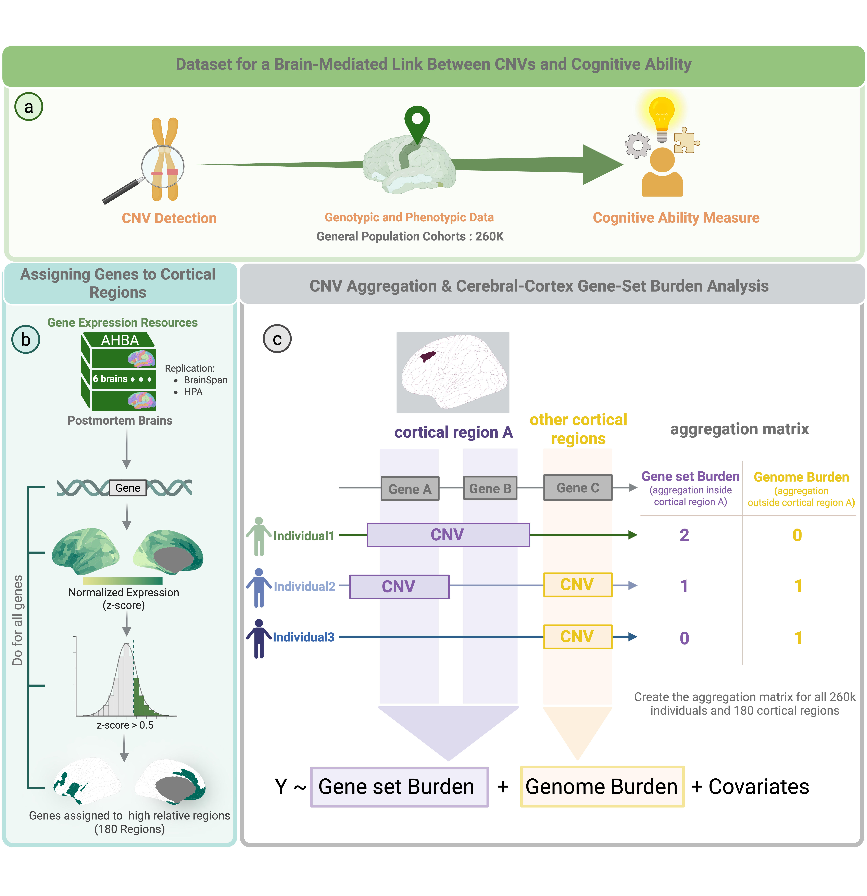

## Project: Mirror-Effect-CNV-Cortex

## Project Title 
Mirror effect of genomic deletions and duplications on cognitive ability across the human cerebral cortex

## Citation
If you use this project or its code in your research, please cite this repository. 

- **Papers:**
1) Core Method: **Kuldeep Kumar**, **Sayeh Kazem**, et al. "Mirror effect of genomic deletions and duplications on cognitive ability across the human cerebral cortex." bioRxiv 2025.01.06.631492; 2025.
2) PGC-CNV application across 6 Psychiatric disorders: **Worrawat Engchuan**, et al. "Psychiatric disorders converge on common pathways but diverge in cellular context, spatial distribution, and directionality of genetic effects." medRxiv 2025.07.11.25331381; 2025.


## Repository Contents
Code for the analysis and figures for the Mirror effect of genomic deletions and duplications across the cortex. The repository is organized into three main components: 
* CC-GSBA: cerebral-cortex gene-set burden analysis (CC-GSBA) pipeline, with simulated toy phenotype data and run;
* Figs: R Markdown (.Rmd) files containing the steps and code to generate the main figures and their associated statistics;
* * SupFigs: R Markdown (.Rmd) files containing the steps and code for generating the supplementary figures. 

In addition, the gene-sets used in the paper (due to size), along with a version of this code, are hosted on **Zenodo** at: [https://doi.org/10.5281/zenodo.17593039](https://doi.org/10.5281/zenodo.17593039)

## CC-GSBA Workflow
Our methodology for associating CNVs with cognitive ability by leveraging gene expression data across cortical regions. The analysis integrates genotypic and phenotypic data from large population cohorts with gene expression data from the Allen Human Brain Atlas (AHBA).

- Gene Assignment: Each gene is mapped to cortical regions where it shows preferential expression (z-score > 0.5). This process is repeated for all genes, resulting in 180 distinct regional gene sets.
- CNV Aggregation: For each individual, we calculate two burden metrics for each cortical region:
- Gene-Set Burden: The count of CNVs overlapping genes within a specific regional gene set.
- Genome Burden: The count of CNVs outside that specific regional gene set, serving as a genome-wide control.
Regression Analysis: A regression model is applied to test for a region-specific association between CNV burden and cognitive ability, while controlling for the genome-wide burden and other covariates.  Cognitive ability (Y) is modeled as a function of the Gene-Set Burden and the Genome Burden. The model also adjusts for standard covariates such as age, sex, and ancestry.

<p align="center">
 
</p>

#### The core script:
The CC-GSBA script is the core pipeline for testing the association between CNVs (Copy Number Variations) aggregated in cortex-specific gene sets and cognitive ability.

#### Data Used in This Repository : 

This repository's pipeline runs on synthetic and non-sensitive toy data to allow for development, testing, and demonstration without the need for access to real human genetic data. The datasets included are:

- Toy Dataset of CNV by Individual: A simulated matrix representing CNV status across individuals.

- Toy Dataset of Gene by CNV: A mapping of CNVs to the genes they affect.

- Simulated Cognitive Ability Measure: A synthetic phenotype/score for the individuals.

- Quality Control Individuals: A subset of individuals who pass a simulated quality control process.

- Real Gene Sets: The actual gene sets (derived from CC_GSBA, assigning section) that are used to aggregate CNV burden.
  
#### File Types
The main CC-GSBA pipeline is implemented in Python Notebooks (*.ipynb).
The toy datasets and real gene sets are all in (*.tsv) formats. See **Zenodo** at: [https://doi.org/10.5281/zenodo.17593039](https://doi.org/10.5281/zenodo.17593039)
for a full set of gene sets. 

#### 💻 Usage

1. Prerequisites: Ensure you have Python 3.11 (for the CC-GSBA notebook) and R version 4.2.2 (for the figures) installed, along with the necessary packages (see requirements.txt).
   
2. Clone the repository:

```bash


git clone https://github.com/SayehKazem/CC_GSBA.git


cd CC_GSBA


```

3. Run the Core Pipeline: Open and run the CC-GSBA/core_pipeline.ipynb notebook to see the full workflow demonstrated on the synthetic data.


## Figs
The RMD files to generate figure panels and statistics for the following:

- Fig. 2: Cortical maps of deletion and duplication effect sizes on cognitive ability.
- Fig. 3: Deletion and duplication effect size maps align with sensorimotor-association cortical organization hierarchy.
- Fig. 4: Gene dosage effects on cognitive ability across levels of regional specificity.
- Fig. 5:  Genetic constraint and gene dosage cortical maps.

## SupFigs
The RMD files to generate supplementary figure panels and statistics for the following:

- Fig. S1. Summary of CNV carriers.
- Fig. S2. Replication in data subsets. 
- Fig. S3. Replication in independent gene expression RNA-seq resources.
- Fig. S4. Replication in alternative methods for defining cortical gene sets from AHBA.
- Fig. S5. Assigning cortical regions to sensorimotor and association axes.
- Fig. S6. Characterizing the impact of age, sex, ancestry, and assessment type. 
- Fig. S7. Correlation between genetic constraint and similarity to cortical gradient. 
- Fig. S8. Characterizing the impact of tissue-specificity, temporal dynamics of gene expression, and cell types.
- Fig. S9. Characterizing the impact of temporal gene expression trajectories, haploinsufficiency score, triplosensitivity score, and Missense-Zscore.
- Fig. S10. Enrichment in gene ontologies across cortical gene sets.


## 📜 Copyright and Licensing

This repository contains both software (code) and non-software content (data, figures, documentation).

* **Code License:** All source code (including Python and R scripts) is licensed under the **MIT License**.
* **Data and Documentation License:** All generated data (including gene sets), figures, and documentation (including the README) are licensed under the **Creative Commons Attribution 4.0 International (CC BY 4.0) License**.

**Copyright (c) 2025** Kuldeep Kumar, Sayeh Kazem, Guillaume Dumas, and Sebastien Jacquemont.

